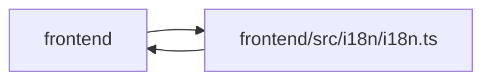

# i18n Module

**Path:** `frontend/src/i18n/i18n.ts`

## Description

_Auto-generated from `frontend/src/i18n/i18n.ts`._

## Imports

| Source | Symbols |
|--------|---------|
| `./resources.en` | `englishResources` |
| `i18next` | `i18n` |
| `react-i18next` | `initReactI18next` |

## Module Signals

| Signal | Values |
|--------|--------|
| Exports | `changeAppLanguage`, `default`, `ensureLanguageResources` |

## Local dependency map

<!-- Auto-generated local dependency summary. Do not edit by hand. -->

> Module-level dependencies exceed the generated-diagram limits, so the diagram and table below group them by top-level package. Counts report the number of module neighbors in each package.

### Internal neighbors

| Direction | Module |
|---|---|
| Inbound | `frontend` (33) |
| Outbound | `frontend` (1) |

### External packages

| Language | Used packages | Undeclared packages |
|---|---:|---:|
| typescript | 2 | 0 |

> All 34 module neighbor(s) are summarized by package because the module-level view exceeds the 12-node limit.

## Classes

| Class | Kind | Line | Bases / Target | Description |
|-------|------|------|----------------|-------------|
| [SupportedLanguage](../entities/SupportedLanguage.md) | Type alias | 5 | — | — |

## Functions

| Function | Signature | Decorators | Description |
|----------|-----------|------------|-------------|
| `ensureLanguageResources` | *(async)* `(language: string)` | — | — |
| `changeAppLanguage` | *(async)* `(language: string)` | — | — |
