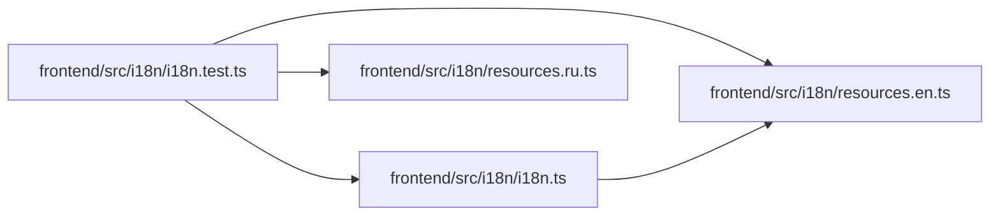

# i18n.test Module

**Path:** `frontend/src/i18n/i18n.test.ts`

## Description

_Auto-generated from `frontend/src/i18n/i18n.test.ts`._

## Imports

| Source | Symbols |
|--------|---------|
| `./i18n` | `i18n`, `changeAppLanguage` |
| `./resources.en` | `englishResources` |
| `./resources.ru` | `russianResources` |
| `vitest` | `describe`, `expect`, `it` |

## Module Signals

| Signal | Values |
|--------|--------|
| Constants | `agentStepIds`, `dynamicMasterKeys` |
| Module calls | `describe` |

## Local dependency map

<!-- Auto-generated local dependency summary. Do not edit by hand. -->

### Internal neighbors

| Direction | Module |
|---|---|
| Outbound | [i18n](../modules/i18n.md) |
| Outbound | [resources.en](../modules/resources.en.md) |
| Outbound | [resources.ru](../modules/resources.ru.md) |

### External packages

| Language | Used packages | Undeclared packages |
|---|---:|---:|
| typescript | 1 | 0 |
