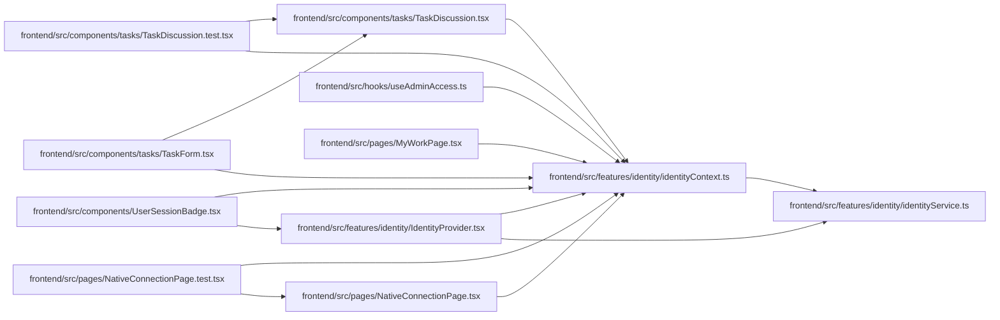

# identityContext Module

**Path:** `frontend/src/features/identity/identityContext.ts`

## Description

_Auto-generated from `frontend/src/features/identity/identityContext.ts`._

## Imports

| Source | Symbols |
|--------|---------|
| `./identityService` | `WorkspaceIdentity` |
| `react` | `createContext`, `useContext` |

## Module Signals

| Signal | Values |
|--------|--------|
| Exports | `IdentityContext`, `useIdentity` |
| Constants | `IdentityContext` |
| Module calls | `IdentityContext = createContext` |

## Local dependency map

<!-- Auto-generated local dependency summary. Do not edit by hand. -->

### Internal neighbors

| Direction | Module |
|---|---|
| Inbound | [TaskDiscussion.test](../modules/TaskDiscussion.test.md) |
| Inbound | [TaskDiscussion](../modules/TaskDiscussion.md) |
| Inbound | [TaskForm](../modules/TaskForm.md) |
| Inbound | [UserSessionBadge](../modules/UserSessionBadge.md) |
| Inbound | [IdentityProvider](../modules/IdentityProvider.md) |
| Inbound | [useAdminAccess](../modules/useAdminAccess.md) |
| Inbound | [MyWorkPage](../modules/MyWorkPage.md) |
| Inbound | [NativeConnectionPage.test](../modules/NativeConnectionPage.test.md) |
| Inbound | [NativeConnectionPage](../modules/NativeConnectionPage.md) |
| Outbound | [identityService](../modules/identityService.md) |

### External packages

| Language | Used packages | Undeclared packages |
|---|---:|---:|
| typescript | 1 | 0 |

## Classes

| Class | Kind | Line | Bases / Target | Description |
|-------|------|------|----------------|-------------|
| [IdentityContextValue](../entities/IdentityContextValue.md) | Type alias | 4 | — | — |

## Functions

| Function | Signature | Decorators | Description |
|----------|-----------|------------|-------------|
| `useIdentity` | `()` | — | — |
