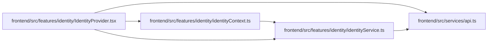

# identityService Module

**Path:** `frontend/src/features/identity/identityService.ts`

## Description

_Auto-generated from `frontend/src/features/identity/identityService.ts`._

## Imports

| Source | Symbols |
|--------|---------|
| `../../services/api` | `api` |

## Module Signals

| Signal | Values |
|--------|--------|
| Exports | `WorkspaceIdentity`, `identityService` |
| Constants | `identityService` |

## Local dependency map

<!-- Auto-generated local dependency summary. Do not edit by hand. -->

### Internal neighbors

| Direction | Module |
|---|---|
| Inbound | [identityContext](../modules/identityContext.md) |
| Inbound | [IdentityProvider](../modules/IdentityProvider.md) |
| Outbound | [api](../modules/api.md) |

## Classes

| Class | Kind | Line | Bases / Target | Description |
|-------|------|------|----------------|-------------|
| [WorkspaceIdentity](../entities/WorkspaceIdentity.md) | Class | 3 | — | — |
