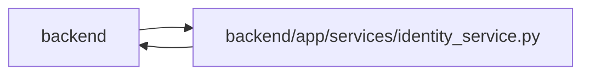

# identity_service Module

**Path:** `backend/app/services/identity_service.py`

## Description

Trusted OIDC sign-in and durable principal/session lifecycle.

OIDC authorization-code sign-in verifies PKCE, browser-bound state, nonce, RS256 signature, issuer, audience, expiry and token bindings before mapping the stable issuer/subject. Sessions are opaque and revocable. Guest ownership transfer requires token proof or reasoned operator recovery, preserves original attribution, and rotates share links. Bounded retention anonymizes expired metadata while retaining referenced identity rows.

An agent principal retains the actor’s explicit profile binding. Principal account disablement is independent of actor runtime activation; a restricted acknowledgement cannot revive an explicitly disabled principal.

## Imports

| Source | Symbols |
|--------|---------|
| `app.authority` | `Authority`, `AuthorityError`, `internal_authority`, `require_operator` |
| `app.commands` | `atomic_command`, `commit_or_flush` |
| `app.config` | `get_settings` |
| `app.maintenance` | `MaintenanceModeError` |
| `app.models.identity` | `Principal`, `IdentitySubject`, `WorkspaceMembership`, `WorkspaceAuthorityState`, `ProjectMembership`, `PrincipalProfileLink`, `OIDCLoginAttempt`, `OwnershipTransfer`, `CommandAudit` |
| `app.models.user_session` | `UserSession` |
| `app.utils.time` | `utc_now`, `as_utc` |
| `base64` | `base64` |
| `dataclasses` | `replace` |
| `datetime` | `timedelta` |
| `hashlib` | `hashlib` |
| `httpx` | `httpx` |
| `json` | `json` |
| `jwt` | `jwt` |
| `secrets` | `secrets` |
| `sqlalchemy` | `select`, `update` |
| `sqlalchemy.exc` | `IntegrityError` |
| `urllib.parse` | `urlencode`, `urlsplit`, `unquote` |

## Local dependency map

<!-- Auto-generated local dependency summary. Do not edit by hand. -->

> Module-level dependencies exceed the generated-diagram limits, so the diagram and table below group them by top-level package. Counts report the number of module neighbors in each package.

### Internal neighbors

| Direction | Module |
|---|---|
| Inbound | `backend` (10) |
| Outbound | `backend` (7) |

### External packages

| Language | Used packages | Undeclared packages |
|---|---:|---:|
| python | 3 | 0 |

> All 17 module neighbor(s) are summarized by package because the module-level view exceeds the 12-node limit.

## Classes

| Class | Line | Bases | Description |
|-------|------|-------|-------------|
| [IdentityService](../entities/IdentityService.md) | 130 | — | — |

## Functions

| Function | Signature | Decorators | Description |
|----------|-----------|------------|-------------|
| `digest` | `(value: str) -> str` | — | — |
| `require_identity_writes` | `()` | — | — |
| `safe_return_path` | `(value: str) -> str` | — | — |
| `oidc_url` | `(value: str) -> str` | — | — |
| `provider_json` | *(async)* `(client: httpx.AsyncClient, method, url, **kwargs)` | — | — |
| `provider_configuration` | *(async)* `(client)` | — | — |
| `validate_id_token` | `(token, jwks, nonce, *, access_token = None, code = None)` | — | — |
| `bind_verified_system` | *(async)* `(db, *, source, reason)` | — | Bind an integration only after its server-owned credential has been verified. |
| `initialize_control_plane` | *(async)* `(db)` | — | Seed the control-plane principal during explicit post-migration repair, never schema-only bootstrap. |