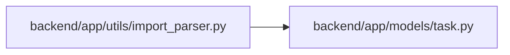

# import_parser Module

**Path:** `backend/app/utils/import_parser.py`

## Description

Parser utilities for importing tasks and team members from text files.

## Imports

| Source | Symbols |
|--------|---------|
| `app.models.task` | `Task` |
| `dataclasses` | `dataclass` |
| `re` | `re` |
| `typing` | `Optional`, `List` |

## Local dependency map

<!-- Auto-generated local dependency summary. Do not edit by hand. -->

### Internal neighbors

| Direction | Module |
|---|---|
| Outbound | [models_task](../modules/models_task.md) |

## Classes

| Class | Line | Bases | Description |
|-------|------|-------|-------------|
| [ParsedTask](../entities/ParsedTask.md) | 9 | — | Parsed task data from text import. |
| [ParsedTeamMember](../entities/ParsedTeamMember.md) | 20 | — | Parsed team member data from text import. |

## Functions

| Function | Signature | Decorators | Description |
|----------|-----------|------------|-------------|
| `parse_tasks_text` | `(text: str) -> list[ParsedTask]` | — | Parse tasks from text format. |
| `_validate_task_fields` | `(line_num: int, priority: int, effort: float)` | — | — |
| `serialize_tasks_to_text` | `(tasks: List[Task]) -> str` | — | Convert a list of tasks into the editable text format. |
| `parse_team_members_text` | `(text: str) -> list[ParsedTeamMember]` | — | Parse team members from text format. |
