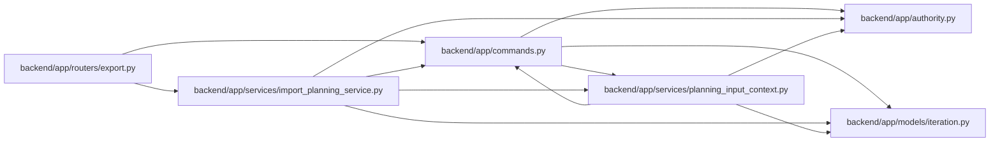

# import_planning_service Module

**Path:** `backend/app/services/import_planning_service.py`

## Description

Coherent, read-only planning observations for bounded JSON imports.

JSON import observations resolve all existing affected iteration revisions, check read coherence and bounded header size, and include a canonical file digest. They never create rows, advance revisions or grant access.

## Imports

| Source | Symbols |
|--------|---------|
| `app.authority` | `internal_authority` |
| `app.commands` | `PlanningConflict` |
| `app.models.iteration` | `Iteration` |
| `app.services.planning_input_context` | `affected_iteration_ids` |
| `hashlib` | `hashlib` |
| `json` | `json` |
| `sqlalchemy` | `select` |

## Local dependency map

<!-- Auto-generated local dependency summary. Do not edit by hand. -->

### Internal neighbors

| Direction | Module |
|---|---|
| Inbound | [export](../modules/export.md) |
| Outbound | [authority](../modules/authority.md) |
| Outbound | [commands](../modules/commands.md) |
| Outbound | [models_iteration](../modules/models_iteration.md) |
| Outbound | [planning_input_context](../modules/planning_input_context.md) |

### External packages

| Language | Used packages | Undeclared packages |
|---|---:|---:|
| python | 1 | 0 |

## Functions

| Function | Signature | Decorators | Description |
|----------|-----------|------------|-------------|
| `observe_import_planning` | *(async)* `(db, iteration_id, data)` | — | — |
