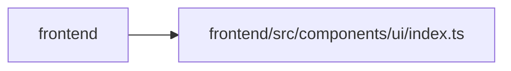

# index Module

**Path:** `frontend/src/components/ui/index.ts`

## Description

_Auto-generated from `frontend/src/components/ui/index.ts`._

## Module Signals

| Signal | Values |
|--------|--------|
| Exports | `ActionGroup`, `FormGrid`, `InlineEmptyState`, `InlineField`, `MetricGrid`, `OverflowMenu`, `OverflowMenuItem`, `PageActions`, `PageHeader`, `PageLayout`, `Pill`, `PillTone`, `STATUS_TONE`, `SectionCard`, `SlideOverDrawer`, `StatusSegment`, `StatusSegmentStrip`, `StickyRail`, `TableFrame`, `Toolbar`, `isTaskStatus`, `pillToneClassName`, `toneBorderClassName`, `toneDotClassName`, `toneGradientClassName`, `toneLineVar`, `toneSoftVar`, `toneSolidClassName`, `toneVar`, `wcPillClass` |

## Local dependency map

<!-- Auto-generated local dependency summary. Do not edit by hand. -->

> Module-level dependencies exceed the generated-diagram limits, so the diagram and table below group them by top-level package. Counts report the number of module neighbors in each package.

### Internal neighbors

| Direction | Module |
|---|---|
| Inbound | `frontend` (23) |

> All 23 module neighbor(s) are summarized by package because the module-level view exceeds the 12-node limit.
