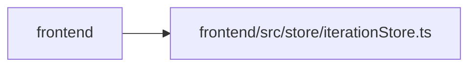

# iterationStore Module

**Path:** `frontend/src/store/iterationStore.ts`

## Description

_Auto-generated from `frontend/src/store/iterationStore.ts`._

## Imports

| Source | Symbols |
|--------|---------|
| `zustand` | `create` |
| `zustand/middleware` | `persist` |

## Module Signals

| Signal | Values |
|--------|--------|
| Exports | `useIterationStore` |
| Constants | `useIterationStore` |
| Module calls | `useIterationStore = create<IterationStore>()` |

## Local dependency map

<!-- Auto-generated local dependency summary. Do not edit by hand. -->

> Module-level dependencies exceed the generated-diagram limits, so the diagram and table below group them by top-level package. Counts report the number of module neighbors in each package.

### Internal neighbors

| Direction | Module |
|---|---|
| Inbound | `frontend` (13) |

### External packages

| Language | Used packages | Undeclared packages |
|---|---:|---:|
| typescript | 1 | 0 |

> All 13 module neighbor(s) are summarized by package because the module-level view exceeds the 12-node limit.

## Classes

| Class | Kind | Line | Bases / Target | Description |
|-------|------|------|----------------|-------------|
| [IterationStore](../entities/IterationStore.md) | Class | 4 | — | — |
