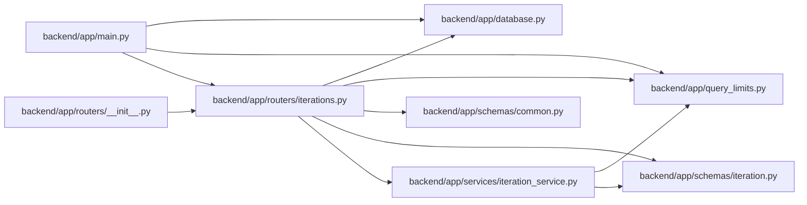

# iterations Module

**Path:** `backend/app/routers/iterations.py`

## Description

Iteration API router.

## Imports

| Source | Symbols |
|--------|---------|
| `app.database` | `get_db` |
| `app.query_limits` | `MAX_ITERATION_LIST_ITEMS` |
| `app.schemas.common` | `MessageResponse` |
| `app.schemas.iteration` | `IterationCreate`, `IterationPlanningReadinessSummary`, `IterationSeriesCreate`, `IterationSeriesResponse`, `IterationUpdate`, `IterationResponse`, `IterationSummary` |
| `app.services.iteration_service` | `IterationService` |
| `datetime` | `date` |
| `fastapi` | `APIRouter`, `Depends`, `HTTPException`, `Query`, `status` |
| `sqlalchemy.ext.asyncio` | `AsyncSession` |
| `typing` | `Annotated` |

## Local dependency map

<!-- Auto-generated local dependency summary. Do not edit by hand. -->

### Internal neighbors

| Direction | Module |
|---|---|
| Inbound | [app_main](../modules/app_main.md) |
| Inbound | [routers___init__](../modules/routers___init__.md) |
| Outbound | [app_database](../modules/app_database.md) |
| Outbound | [query_limits](../modules/query_limits.md) |
| Outbound | [schemas_common](../modules/schemas_common.md) |
| Outbound | [schemas_iteration](../modules/schemas_iteration.md) |
| Outbound | [iteration_service](../modules/iteration_service.md) |

### External packages

| Language | Used packages | Undeclared packages |
|---|---:|---:|
| python | 2 | 0 |

## Functions

| Function | Signature | Decorators | Description |
|----------|-----------|------------|-------------|
| `get_iteration_service` | *(async)* `(db: Annotated[AsyncSession, Depends(get_db, scope='function')]) -> IterationService` | — | Dependency for iteration service. |
| `get_iterations` | *(async)* `(service: Annotated[IterationService, Depends(get_iteration_service)], limit: Annotated[int \| None, Query(ge=1, le=MAX_ITERATION_LIST_ITEMS)] = None, cursor_start_date: date \| None = None, cursor_id: int \| None = None)` | `@router.get('/iterations', response_model=list[IterationResponse])` | Get the compatible small list or one explicit stable keyset page. |
| `create_iteration` | *(async)* `(data: IterationCreate, service: Annotated[IterationService, Depends(get_iteration_service)])` | `@router.post('/iterations', response_model=IterationResponse, status_code=status.HTTP_201_CREATED)` | Create a new iteration. |
| `create_iteration_series` | *(async)* `(data: IterationSeriesCreate, service: Annotated[IterationService, Depends(get_iteration_service)])` | `@router.post('/iterations/series', response_model=IterationSeriesResponse, status_code=status.HTTP_201_CREATED)` | Create a back-to-back series of iterations. |
| `get_iteration` | *(async)* `(iteration_id: int, service: Annotated[IterationService, Depends(get_iteration_service)])` | `@router.get('/iterations/{iteration_id}', response_model=IterationResponse)` | Get iteration by ID. |
| `update_iteration` | *(async)* `(iteration_id: int, data: IterationUpdate, service: Annotated[IterationService, Depends(get_iteration_service)])` | `@router.put('/iterations/{iteration_id}', response_model=IterationResponse)` | Update an iteration. |
| `delete_iteration` | *(async)* `(iteration_id: int, service: Annotated[IterationService, Depends(get_iteration_service)])` | `@router.delete('/iterations/{iteration_id}', response_model=MessageResponse)` | Delete an iteration. |
| `get_iteration_summary` | *(async)* `(iteration_id: int, service: Annotated[IterationService, Depends(get_iteration_service)])` | `@router.get('/iterations/{iteration_id}/summary', response_model=IterationSummary)` | Get iteration summary with statistics. |
| `get_iteration_planning_readiness` | *(async)* `(iteration_id: int, service: Annotated[IterationService, Depends(get_iteration_service)])` | `@router.get('/iterations/{iteration_id}/planning-readiness', response_model=IterationPlanningReadinessSummary)` | Get the compact aggregate used by persistent planning navigation. |
