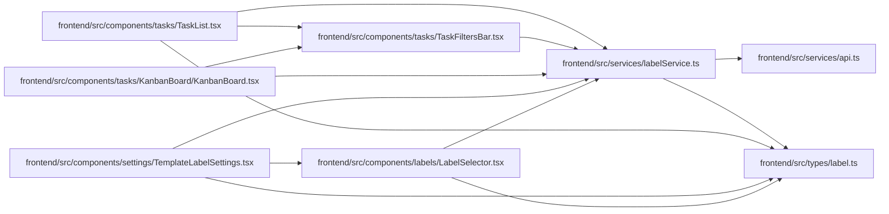

# labelService Module

**Path:** `frontend/src/services/labelService.ts`

## Description

_Auto-generated from `frontend/src/services/labelService.ts`._

## Imports

| Source | Symbols |
|--------|---------|
| `../types/label` | `Label`, `LabelCreate`, `LabelGroup`, `LabelGroupCreate`, `LabelGroupListParams`, `LabelGroupUpdate`, `LabelListParams`, `LabelUpdate` |
| `./api` | `api` |

## Module Signals

| Signal | Values |
|--------|--------|
| Exports | `FrontendLabelService`, `labelService` |
| Constants | `labelService` |

## Local dependency map

<!-- Auto-generated local dependency summary. Do not edit by hand. -->

### Internal neighbors

| Direction | Module |
|---|---|
| Inbound | [LabelSelector](../modules/LabelSelector.md) |
| Inbound | [TemplateLabelSettings](../modules/TemplateLabelSettings.md) |
| Inbound | [KanbanBoard](../modules/KanbanBoard.md) |
| Inbound | [TaskFiltersBar](../modules/TaskFiltersBar.md) |
| Inbound | [TaskList](../modules/TaskList.md) |
| Outbound | [api](../modules/api.md) |
| Outbound | [types_label](../modules/types_label.md) |

## Classes

| Class | Kind | Line | Bases / Target | Description |
|-------|------|------|----------------|-------------|
| [FrontendLabelService](../entities/FrontendLabelService.md) | Class | 41 | — | — |
