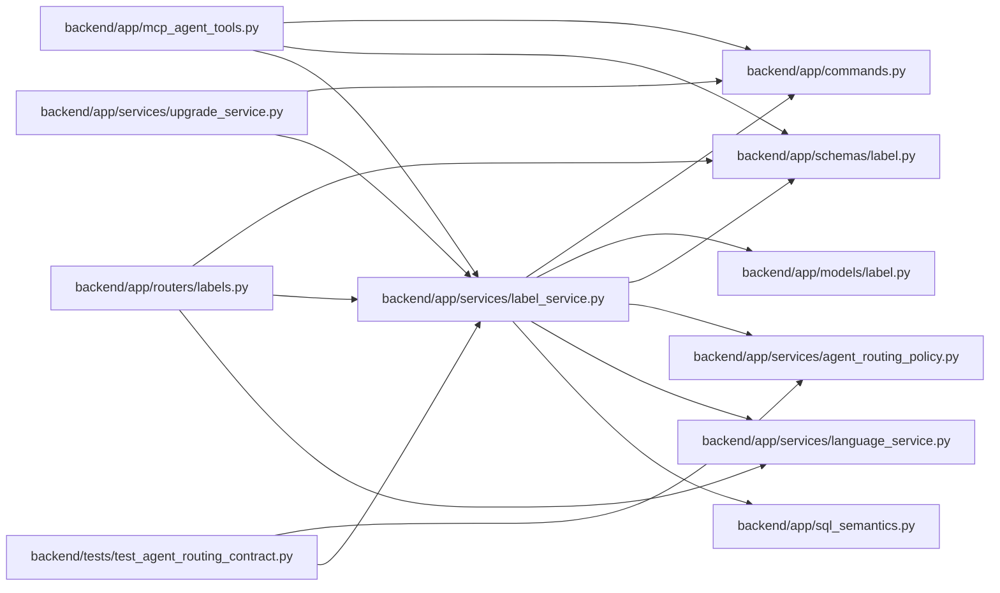

# label_service Module

**Path:** `backend/app/services/label_service.py`

## Description

Service for governed label taxonomy and built-in defaults.

## Imports

| Source | Symbols |
|--------|---------|
| `app.commands` | `commit_or_flush` |
| `app.models.label` | `Label`, `LabelGroup` |
| `app.schemas.label` | `LabelCreate`, `LabelGroupCreate`, `LabelGroupUpdate`, `LabelUpdate` |
| `app.services.agent_routing_policy` | `CAPABILITY_LABEL_SKILL_KEYS` |
| `app.services.language_service` | `backend_error_message`, `entity_not_found_message`, `resolve_runtime_ui_language` |
| `app.sql_semantics` | `portable_contains` |
| `sqlalchemy` | `Select`, `or_`, `select` |
| `sqlalchemy.exc` | `IntegrityError` |
| `sqlalchemy.ext.asyncio` | `AsyncSession` |
| `sqlalchemy.orm` | `selectinload`, `with_loader_criteria` |
| `typing` | `Any`, `Optional`, `Sequence` |

## Local dependency map

<!-- Auto-generated local dependency summary. Do not edit by hand. -->

### Internal neighbors

| Direction | Module |
|---|---|
| Inbound | [mcp_agent_tools](../modules/mcp_agent_tools.md) |
| Inbound | [labels](../modules/labels.md) |
| Inbound | [upgrade_service](../modules/upgrade_service.md) |
| Inbound | [test_agent_routing_contract](../modules/test_agent_routing_contract.md) |
| Outbound | [commands](../modules/commands.md) |
| Outbound | [models_label](../modules/models_label.md) |
| Outbound | [schemas_label](../modules/schemas_label.md) |
| Outbound | [agent_routing_policy](../modules/agent_routing_policy.md) |
| Outbound | [language_service](../modules/language_service.md) |
| Outbound | [sql_semantics](../modules/sql_semantics.md) |

### External packages

| Language | Used packages | Undeclared packages |
|---|---:|---:|
| python | 1 | 0 |

## Classes

| Class | Line | Bases | Description |
|-------|------|-------|-------------|
| [LabelService](../entities/LabelService.md) | 112 | — | Service for label group and label CRUD plus built-in label seeding. |
| [LabelConflictError](../entities/LabelConflictError.md) | 319 | `ValueError` | Raised when label taxonomy uniqueness constraints are violated. |
