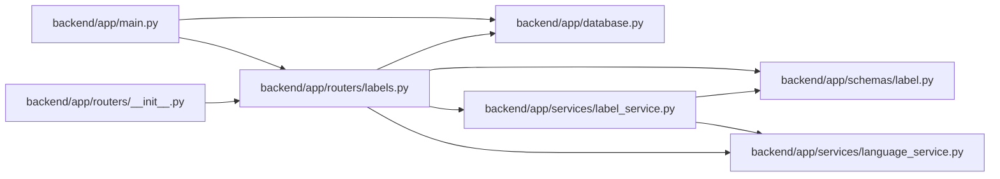

# labels Module

**Path:** `backend/app/routers/labels.py`

## Description

Label taxonomy API router.

## Imports

| Source | Symbols |
|--------|---------|
| `app.database` | `get_db` |
| `app.schemas.label` | `LabelCreate`, `LabelGroupCreate`, `LabelGroupResponse`, `LabelGroupUpdate`, `LabelResponse`, `LabelUpdate` |
| `app.services.label_service` | `LabelConflictError`, `LabelService` |
| `app.services.language_service` | `entity_not_found_message`, `resolve_runtime_ui_language` |
| `fastapi` | `APIRouter`, `Depends`, `HTTPException`, `Query`, `status` |
| `sqlalchemy.ext.asyncio` | `AsyncSession` |
| `typing` | `Annotated`, `Optional` |

## Local dependency map

<!-- Auto-generated local dependency summary. Do not edit by hand. -->

### Internal neighbors

| Direction | Module |
|---|---|
| Inbound | [app_main](../modules/app_main.md) |
| Inbound | [routers___init__](../modules/routers___init__.md) |
| Outbound | [app_database](../modules/app_database.md) |
| Outbound | [schemas_label](../modules/schemas_label.md) |
| Outbound | [label_service](../modules/label_service.md) |
| Outbound | [language_service](../modules/language_service.md) |

### External packages

| Language | Used packages | Undeclared packages |
|---|---:|---:|
| python | 2 | 0 |

## Functions

| Function | Signature | Decorators | Description |
|----------|-----------|------------|-------------|
| `get_label_service` | *(async)* `(db: Annotated[AsyncSession, Depends(get_db, scope='function')]) -> LabelService` | — | Dependency for label service. |
| `list_label_groups` | *(async)* `(service: Annotated[LabelService, Depends(get_label_service)], include_inactive: bool = Query(False))` | `@router.get('/label-groups', response_model=list[LabelGroupResponse])` | List governed label groups. |
| `create_label_group` | *(async)* `(data: LabelGroupCreate, service: Annotated[LabelService, Depends(get_label_service)])` | `@router.post('/label-groups', response_model=LabelGroupResponse, status_code=status.HTTP_201_CREATED)` | Create a governed label group. |
| `update_label_group` | *(async)* `(group_id: int, data: LabelGroupUpdate, service: Annotated[LabelService, Depends(get_label_service)])` | `@router.put('/label-groups/{group_id}', response_model=LabelGroupResponse)` | Update a governed label group. |
| `list_labels` | *(async)* `(service: Annotated[LabelService, Depends(get_label_service)], group_key: Annotated[Optional[str], Query()] = None, include_inactive: bool = Query(False), q: Annotated[Optional[str], Query()] = None)` | `@router.get('/labels', response_model=list[LabelResponse])` | List governed labels. |
| `create_label` | *(async)* `(data: LabelCreate, service: Annotated[LabelService, Depends(get_label_service)])` | `@router.post('/labels', response_model=LabelResponse, status_code=status.HTTP_201_CREATED)` | Create a governed label. |
| `update_label` | *(async)* `(label_id: int, data: LabelUpdate, service: Annotated[LabelService, Depends(get_label_service)])` | `@router.put('/labels/{label_id}', response_model=LabelResponse)` | Update a governed label. |
