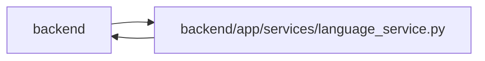

# language_service Module

**Path:** `backend/app/services/language_service.py`

## Description

Language resolution helpers for UI and AI output.

## Imports

| Source | Symbols |
|--------|---------|
| `__future__` | `annotations` |
| `app.config` | `get_settings` |
| `app.services.system_settings_service` | `RuntimeSettingsService` |
| `dataclasses` | `dataclass` |
| `datetime` | `date` |
| `html` | `escape` |
| `logging` | `logging` |
| `re` | `re` |
| `typing` | `Any`, `Literal` |

## Local dependency map

<!-- Auto-generated local dependency summary. Do not edit by hand. -->

> Module-level dependencies exceed the generated-diagram limits, so the diagram and table below group them by top-level package. Counts report the number of module neighbors in each package.

### Internal neighbors

| Direction | Module |
|---|---|
| Inbound | `backend` (16) |
| Outbound | `backend` (2) |

> All 18 module neighbor(s) are summarized by package because the module-level view exceeds the 12-node limit.

## Classes

| Class | Kind | Line | Bases / Target | Description |
|-------|------|------|----------------|-------------|
| [LanguageCode](../entities/language_service_LanguageCode.md) | Type alias | 11 | `Literal['en', 'ru']` | — |
| [AILanguageMode](../entities/language_service_AILanguageMode.md) | Type alias | 12 | `Literal['auto', 'en', 'ru']` | — |
| [LanguageResolution](../entities/LanguageResolution.md) | Class | 25 | — | Resolved language selection and the reason it was chosen. |

## Functions

| Function | Signature | Decorators | Description |
|----------|-----------|------------|-------------|
| `normalize_language` | `(value: Any, default: LanguageCode = 'en') -> LanguageCode` | — | Return a supported UI/output language. |
| `normalize_ai_language_mode` | `(value: Any, default: AILanguageMode = 'auto') -> AILanguageMode` | — | Return a supported AI language mode. |
| `flatten_language_context` | `(value: Any) -> str` | — | Flatten nested context data into text for language detection. |
| `detect_language_from_text` | `(text: str) -> LanguageCode \| None` | — | Detect English/Russian from dominant script in source context. |
| `resolve_ai_language` | `(context: Any, default_language: LanguageCode = 'en', mode: AILanguageMode = 'auto') -> LanguageResolution` | — | Resolve the AI output language from mode, context, and fallback language. |
| `language_instruction` | `(language: LanguageCode) -> str` | — | Return a prompt instruction that localizes prose while preserving technical tokens. |
| `localized` | `(language: LanguageCode, en: str, ru: str) -> str` | — | Return a localized string for deterministic fallback text. |
| `entity_not_found_message` | `(entity: str, entity_id: Any, language: LanguageCode = 'en') -> str` | — | Return the existing `<entity> with id <id> not found` shape localized. |
| `scoped_entity_not_found_message` | `(entity: str, entity_id: Any, scope: str, scope_id: Any, language: LanguageCode = 'en') -> str` | — | Return a localized `not found for <scope>` detail while preserving IDs. |
| `entity_deleted_message` | `(entity: str, entity_id: Any, language: LanguageCode = 'en') -> str` | — | Return a localized deletion success message without changing response shape. |
| `backend_error_message` | `(message: str, language: LanguageCode = 'en') -> str` | — | Localize common backend-generated detail strings while preserving tokens and IDs. |
| `resolve_runtime_ui_language` | *(async)* `(db: Any = None, default: LanguageCode \| None = None) -> LanguageCode` | — | Resolve the runtime UI language from DB-backed settings, then environment/default. |
| `task_status_label` | `(status: str, language: LanguageCode = 'en') -> str` | — | Return a user-facing label for a task status while preserving unknown enum values. |
| `invalid_status_transition_message` | `(old_status: str, new_status: str, language: LanguageCode = 'en') -> str` | — | Return the existing status-transition validation detail shape in the UI language. |
| `task_requires_schedule_message` | `(language: LanguageCode = 'en') -> str` | — | Return the transition error shown when a planned task lacks scheduled dates. |
| `incomplete_dependency_message` | `(dependency_title: str, dependency_status: str, language: LanguageCode = 'en') -> str` | — | Return the transition error shown when a dependency blocks activation. |
| `automatic_child_status_reason` | `(language: LanguageCode = 'en') -> str` | — | Return the audit reason for automatic parent status updates. |
| `notification_status_change_subject` | `(task_id: int, old_status: str, new_status: str, language: LanguageCode = 'en') -> str` | — | Return a localized status-change email subject. |
| `notification_status_change_body_html` | `(task_title: str, task_id: int, old_status: str, new_status: str, cascade_updates: list[dict], reason: str \| None, language: LanguageCode = 'en') -> str` | — | Return a localized status-change email body. |
| `notification_overdue_subject` | `(task_id: int, days_overdue: int, language: LanguageCode = 'en') -> str` | — | Return a localized overdue-start email subject. |
| `notification_overdue_body_html` | `(task_title: str, task_id: int, planned_start: date, days_overdue: int, language: LanguageCode = 'en') -> str` | — | Return a localized overdue-start email body. |
