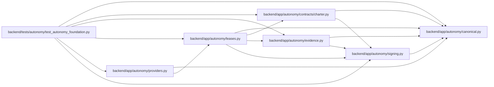

# leases Module

**Path:** `backend/app/autonomy/leases.py`

## Description

Short-lived exact-target action leases parented to durable attempt starts.

## Imports

| Source | Symbols |
|--------|---------|
| `__future__` | `annotations` |
| `app.autonomy.canonical` | `StrictContractModel`, `canonical_json_bytes`, `sha256_hex` |
| `app.autonomy.contracts.charter` | `AutonomyCharter`, `ExactResourceBinding` |
| `app.autonomy.evidence` | `AttemptEventType`, `AttemptLedgerBackend`, `AttemptLedgerRecord`, `ZERO_DIGEST`, `validate_attempt_ledger_snapshot` |
| `app.autonomy.signing` | `DetachedSignatureEnvelope`, `PublicTrustResolver`, `RemoteSigner`, `verify_detached_signature` |
| `collections.abc` | `Callable` |
| `datetime` | `UTC`, `datetime`, `timedelta` |
| `pydantic` | `Field`, `model_validator` |
| `typing` | `Literal` |

## Local dependency map

<!-- Auto-generated local dependency summary. Do not edit by hand. -->

### Internal neighbors

| Direction | Module |
|---|---|
| Inbound | [providers](../modules/providers.md) |
| Inbound | [test_autonomy_foundation](../modules/test_autonomy_foundation.md) |
| Outbound | [autonomy_canonical](../modules/autonomy_canonical.md) |
| Outbound | [charter](../modules/charter.md) |
| Outbound | [evidence](../modules/evidence.md) |
| Outbound | [signing](../modules/signing.md) |

### External packages

| Language | Used packages | Undeclared packages |
|---|---:|---:|
| python | 1 | 0 |

## Classes

| Class | Line | Bases | Description |
|-------|------|-------|-------------|
| [ActionLeaseRequest](../entities/ActionLeaseRequest.md) | 33 | `StrictContractModel` | — |
| [ActionLease](../entities/ActionLease.md) | 76 | `StrictContractModel` | — |
| [SignedActionLease](../entities/SignedActionLease.md) | 127 | `StrictContractModel` | — |
| [ActionLeasePolicy](../entities/ActionLeasePolicy.md) | 132 | — | Non-generative issuer that cannot invent authority or attempt ancestry. |

## Functions

| Function | Signature | Decorators | Description |
|----------|-----------|------------|-------------|
| `verify_action_lease` | `(signed: SignedActionLease, *, trust_resolver: PublicTrustResolver, ledger_backend: AttemptLedgerBackend, expected_action: str, expected_environment: Literal['ephemeral', 'rehearsal', 'production'], expected_destructive: bool, expected_resource_ref: str, expected_resource_generation: str, now: datetime) -> ActionLease` | — | Adapter-side verification before any provider mutation. |
