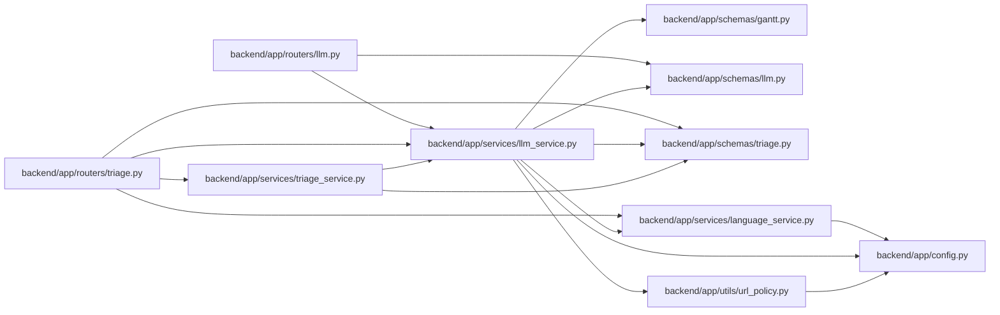

# llm_service Module

**Path:** `backend/app/services/llm_service.py`

## Description

LLM service for task formalization and schedule explanation.

## Imports

| Source | Symbols |
|--------|---------|
| `app.config` | `get_settings` |
| `app.schemas.gantt` | `SchedulingDecision`, `WorkloadIssue` |
| `app.schemas.llm` | `FormalizeResponse`, `SuggestedSubtask`, `ImproveDescriptionResponse`, `ExplainScheduleResponse`, `ScheduleDecisionExplanation`, `WorkloadAnalysis`, `GroundedAISuggestionResponse`, `GroundedFact` |
| `app.schemas.triage` | `TriageClassificationDraft`, `TriageTaskDraftResponse` |
| `app.services.language_service` | `AILanguageMode`, `LanguageCode`, `language_instruction`, `localized`, `normalize_ai_language_mode`, `normalize_language`, `resolve_ai_language` |
| `app.utils.url_policy` | `normalize_provider_api_url` |
| `collections` | `Counter` |
| `dataclasses` | `dataclass` |
| `httpx` | `httpx` |
| `json` | `json` |
| `logging` | `logging` |
| `re` | `re` |
| `typing` | `Any`, `Optional` |

## Local dependency map

<!-- Auto-generated local dependency summary. Do not edit by hand. -->

### Internal neighbors

| Direction | Module |
|---|---|
| Inbound | [routers_llm](../modules/routers_llm.md) |
| Inbound | [routers_triage](../modules/routers_triage.md) |
| Inbound | [triage_service](../modules/triage_service.md) |
| Outbound | [config](../modules/config.md) |
| Outbound | [schemas_gantt](../modules/schemas_gantt.md) |
| Outbound | [schemas_llm](../modules/schemas_llm.md) |
| Outbound | [schemas_triage](../modules/schemas_triage.md) |
| Outbound | [language_service](../modules/language_service.md) |
| Outbound | [url_policy](../modules/url_policy.md) |

### External packages

| Language | Used packages | Undeclared packages |
|---|---:|---:|
| python | 1 | 0 |

## Classes

| Class | Line | Bases | Description |
|-------|------|-------|-------------|
| [LLMCallResult](../entities/LLMCallResult.md) | 42 | — | Normalized OpenAI-compatible chat completion result. |
| [LLMService](../entities/LLMService.md) | 54 | — | Service for LLM-powered features. |
