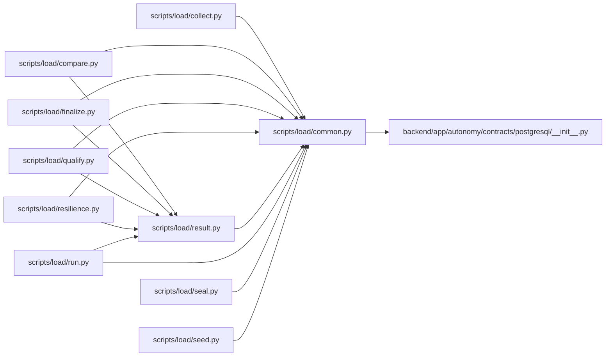

# common Module

**Path:** `scripts/load/common.py`

## Description

Shared, fail-closed contracts for the WorkChord load and qualification tools.

## Imports

| Source | Symbols |
|--------|---------|
| `__future__` | `annotations` |
| `app.autonomy.contracts.postgresql` | `ContractBundleError`, `PostgreSQLContractBundle`, `load_postgresql_contract_bundle` |
| `datetime` | `UTC`, `datetime` |
| `functools` | `lru_cache` |
| `hashlib` | `hashlib` |
| `json` | `json` |
| `os` | `os` |
| `pathlib` | `Path` |
| `typing` | `Any`, `Mapping` |
| `urllib.parse` | `urlsplit` |

## Local dependency map

<!-- Auto-generated local dependency summary. Do not edit by hand. -->

### Internal neighbors

| Direction | Module |
|---|---|
| Inbound | [collect](../modules/collect.md) |
| Inbound | [compare](../modules/compare.md) |
| Inbound | [finalize](../modules/finalize.md) |
| Inbound | [qualify](../modules/qualify.md) |
| Inbound | [resilience](../modules/resilience.md) |
| Inbound | [result](../modules/result.md) |
| Inbound | [run](../modules/run.md) |
| Inbound | [seal](../modules/seal.md) |
| Inbound | [seed](../modules/seed.md) |
| Outbound | [postgresql___init__](../modules/postgresql___init__.md) |

### External packages

| Language | Used packages | Undeclared packages |
|---|---:|---:|
| python | 1 | 1 |

## Classes

| Class | Line | Bases | Description |
|-------|------|-------|-------------|
| [QualificationInputError](../entities/QualificationInputError.md) | 34 | `ValueError` | A workload or evidence input is unsafe, stale, or incomplete. |

## Functions

| Function | Signature | Decorators | Description |
|----------|-----------|------------|-------------|
| `canonical_json_bytes` | `(value: Any) -> bytes` | — | — |
| `sha256_bytes` | `(value: bytes) -> str` | — | — |
| `sha256_file` | `(path: Path) -> str` | — | — |
| `seal_document` | `(payload: Mapping[str, Any]) -> dict[str, Any]` | — | — |
| `verify_document` | `(document: Mapping[str, Any]) -> str` | — | — |
| `read_json_object` | `(path: Path, *, sealed: bool = False) -> dict[str, Any]` | — | — |
| `contract_bundle` | `() -> PostgreSQLContractBundle` | `@lru_cache(maxsize=1)` | — |
| `contract_member_json` | `(member: str) -> dict[str, Any]` | — | — |
| `contract_member_sha256` | `(member: str) -> str` | — | — |
| `atomic_write_json` | `(path: Path, payload: Mapping[str, Any], *, sealed: bool = True, mode: int = 384) -> dict[str, Any]` | — | — |
| `capacity_contract` | `() -> dict[str, Any]` | — | — |
| `contract_sha256` | `() -> str` | — | — |
| `traffic_profile` | `(contract: Mapping[str, Any], profile_id: str) -> dict[str, Any]` | — | — |
| `utc_now_text` | `() -> str` | — | — |
| `authorized_base_url` | `(base_url: str, *, authorize_host: str, environment: str, production_authorization: str \| None, change_id: str \| None) -> str` | — | — |
