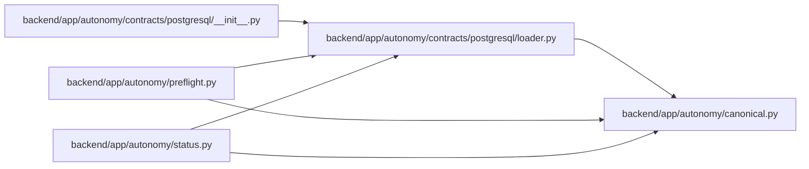

# loader Module

**Path:** `backend/app/autonomy/contracts/postgresql/loader.py`

## Description

Installed-resource loader for the PostgreSQL machine contract bundle.

## Imports

| Source | Symbols |
|--------|---------|
| `__future__` | `annotations` |
| `app.autonomy.canonical` | `StrictContractModel`, `canonical_json_bytes`, `sha256_hex` |
| `dataclasses` | `dataclass` |
| `importlib` | `resources` |
| `json` | `json` |
| `pydantic` | `Field`, `model_validator` |
| `typing` | `Literal`, `Protocol`, `runtime_checkable` |

## Local dependency map

<!-- Auto-generated local dependency summary. Do not edit by hand. -->

### Internal neighbors

| Direction | Module |
|---|---|
| Inbound | [postgresql___init__](../modules/postgresql___init__.md) |
| Inbound | [preflight](../modules/preflight.md) |
| Inbound | [status](../modules/status.md) |
| Outbound | [autonomy_canonical](../modules/autonomy_canonical.md) |

### External packages

| Language | Used packages | Undeclared packages |
|---|---:|---:|
| python | 1 | 0 |

## Classes

| Class | Line | Bases | Description |
|-------|------|-------|-------------|
| [ContractSourceInput](../entities/ContractSourceInput.md) | 62 | `StrictContractModel` | — |
| [ContractMachineMember](../entities/ContractMachineMember.md) | 72 | `StrictContractModel` | — |
| [ContractTrace](../entities/ContractTrace.md) | 78 | `StrictContractModel` | — |
| [PostgreSQLContractManifest](../entities/PostgreSQLContractManifest.md) | 87 | `StrictContractModel` | — |
| [ImmutableContractArchive](../entities/ImmutableContractArchive.md) | 142 | `Protocol` | Read exact charter-pinned immutable input bytes by logical key/digest. |
| [ContractBundleError](../entities/ContractBundleError.md) | 148 | `ValueError` | — |
| [PostgreSQLContractBundle](../entities/PostgreSQLContractBundle.md) | 153 | — | — |

## Functions

| Function | Signature | Decorators | Description |
|----------|-----------|------------|-------------|
| `load_postgresql_contract_bundle` | `(*, archive: ImmutableContractArchive \| None = None, require_archive: bool = False) -> PostgreSQLContractBundle` | — | Load solely through package resources and optionally verify the WORM archive. |
| `_validate_machine_semantics` | `(manifest: PostgreSQLContractManifest, members: dict[str, bytes]) -> None` | — | — |
