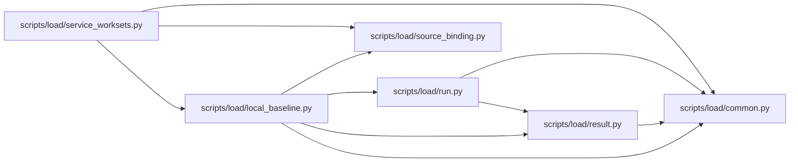

# local_baseline Module

**Path:** `scripts/load/local_baseline.py`

## Description

Local synthetic observations reuse the qualification recorder and percentile utilities but never issue capacity certification. A matching predeclared workload, finite samples and explicit identity/transport scope are required. Loopback HTTP measurement verifies the owned nonce, separates human cookies from agent credentials, and records real interruption cleanup/recovery; limits and budget misses remain limitations.

Expected collection-limit outcomes require both the declared `collection_limit_exceeded` code and HTTP 413. Success responses must carry no error code; other status/code combinations count as unexpected failures, and malformed HTTP statuses are rejected before recording.

Summarize declared local observations without issuing capacity certification.

Frozen observations must include every declared operation and client for the declared number of rounds. The owned HTTP lane measures four retained pages and one head refresh, separates human cookies from agent headers, preserves preliminary raw reads before recovery checks, and verifies stale-write rejection plus independent cleanup readback. Live source identities are independently computed; replayed observations identify the current binding as processor scope only.

## Imports

| Source | Symbols |
|--------|---------|
| `__future__` | `annotations` |
| `argparse` | `argparse` |
| `asyncio` | `asyncio` |
| `collections` | `Counter`, `defaultdict` |
| `httpx` | `httpx` |
| `json` | `json` |
| `math` | `math` |
| `os` | `os` |
| `pathlib` | `Path` |
| `platform` | `platform` |
| `scripts.load.common` | `QualificationInputError`, `atomic_write_json`, `sha256_file`, `utc_now_text`, `authorized_base_url` |
| `scripts.load.result` | `latency_summary` |
| `scripts.load.run` | `Attempt`, `Recorder` |
| `scripts.load.source_binding` | `source_binding`, `verify_binding` |
| `subprocess` | `subprocess` |
| `time` | `time` |
| `urllib.parse` | `urlsplit` |

## Local dependency map

<!-- Auto-generated local dependency summary. Do not edit by hand. -->

### Internal neighbors

| Direction | Module |
|---|---|
| Inbound | [service_worksets](../modules/service_worksets.md) |
| Outbound | [load_common](../modules/load_common.md) |
| Outbound | [result](../modules/result.md) |
| Outbound | [run](../modules/run.md) |
| Outbound | [source_binding](../modules/source_binding.md) |

### External packages

| Language | Used packages | Undeclared packages |
|---|---:|---:|
| python | 1 | 1 |

## Functions

| Function | Signature | Decorators | Description |
|----------|-----------|------------|-------------|
| `summarize` | `(raw, declaration)` | — | — |
| `measure` | *(async)* `(args, declaration)` | — | — |
| `main` | `()` | — | — |