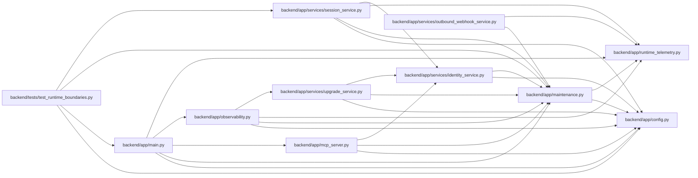

# maintenance Module

**Path:** `backend/app/maintenance.py`

## Description

Fail-closed maintenance/validation authority shared by REST, MCP, and workers.

## Imports

| Source | Symbols |
|--------|---------|
| `__future__` | `annotations` |
| `app.config` | `get_settings` |
| `app.runtime_telemetry` | `activity`, `correlation_id_context`, `metrics` |
| `hashlib` | `hashlib` |
| `json` | `json` |
| `re` | `re` |
| `socket` | `socket` |
| `starlette.responses` | `JSONResponse` |
| `starlette.types` | `ASGIApp`, `Message`, `Receive`, `Scope`, `Send` |
| `time` | `monotonic` |
| `typing` | `Any` |
| `uuid` | `uuid4` |

## Local dependency map

<!-- Auto-generated local dependency summary. Do not edit by hand. -->

### Internal neighbors

| Direction | Module |
|---|---|
| Inbound | [app_main](../modules/app_main.md) |
| Inbound | [mcp_server](../modules/mcp_server.md) |
| Inbound | [observability](../modules/observability.md) |
| Inbound | [identity_service](../modules/identity_service.md) |
| Inbound | [outbound_webhook_service](../modules/outbound_webhook_service.md) |
| Inbound | [session_service](../modules/session_service.md) |
| Inbound | [upgrade_service](../modules/upgrade_service.md) |
| Inbound | [test_runtime_boundaries](../modules/test_runtime_boundaries.md) |
| Outbound | [config](../modules/config.md) |
| Outbound | [runtime_telemetry](../modules/runtime_telemetry.md) |

### External packages

| Language | Used packages | Undeclared packages |
|---|---:|---:|
| python | 1 | 1 |

## Classes

| Class | Line | Bases | Description |
|-------|------|-------|-------------|
| [MaintenanceModeError](../entities/MaintenanceModeError.md) | 25 | `RuntimeError` | A write or non-allowlisted validation read was fenced. |
| [RuntimeBoundaryMiddleware](../entities/RuntimeBoundaryMiddleware.md) | 134 | — | Enforce REST fencing and record bounded request/drain telemetry. |

## Functions

| Function | Signature | Decorators | Description |
|----------|-----------|------------|-------------|
| `maintenance_configuration_fingerprint` | `() -> str` | — | Identify the complete restart-bound fence configuration. |
| `maintenance_state` | `() -> dict[str, Any]` | — | — |
| `_path_allowed` | `(path: str, allowlist: list[str]) -> bool` | — | — |
| `_is_mcp_path` | `(path: str) -> bool` | — | — |
| `scope_requirement_is_mutating` | `(required_scope: Any) -> bool` | — | Classify MCP mutations from their enforced authorization contract. |
| `enforce_mcp_access` | `(required_scope: Any) -> None` | — | Fence every scope-classified MCP mutation before opening a transaction. |
| `require_background_writes_enabled` | `(operation: str) -> None` | — | Fence worker, seed, and repair writes under the same deployment mode. |
| `_header` | `(scope: Scope, name: str) -> str \| None` | — | — |
