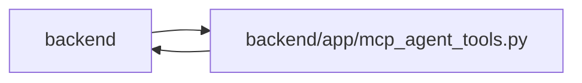

# mcp_agent_tools Module

**Path:** `backend/app/mcp_agent_tools.py`

## Description

Framework-neutral MCP tool handlers for agent task access.

These functions intentionally delegate to domain services so REST and MCP use
the same audited command and read-model paths.

## Imports

| Source | Symbols |
|--------|---------|
| `app.agent_contract` | `agent_contract_features` |
| `app.commands` | `commit_or_flush` |
| `app.config` | `get_settings` |
| `app.models.agent` | `AgentActor`, `AgentIdempotencyRecord` |
| `app.mutation_versions` | `require_mutation_revision` |
| `app.routers.gantt` | `get_gantt_data` |
| `app.schemas.agent` | `AgentCapabilitiesResponse`, `AgentDiscoveryTriageCreate`, `AgentProjectUpdateCreate`, `AgentRecoveryRequeue`, `AgentReviewVerdict`, `AgentRunDetailResponse`, `AgentRunCreate`, `AgentRunEventResponse`, `AgentRunEventCreate`, `AgentRunFinish`, `AgentTaskAssignmentCreate`, `AgentTaskAssignmentUpdate`, `AgentTaskCreate`, `AgentTaskPatch`, `AgentWorkBegin`, `AgentWorkRenew`, `AgentWorkSubmit`, `AgentWorkTerminal`, `ModelAwareAgentTaskAssignmentCreate`, `ModelAwareAgentTaskAssignmentUpdate`, `ModelAwareAgentWorkBegin`, `TaskClaimRequest`, `TaskEventCreate` |
| `app.schemas.agent_planning` | `AgentPlanningCommandContext`, `AgentScheduleCommand` |
| `app.schemas.agent_routing` | `AgentModelBindingCreate`, `AgentModelBindingDisable`, `AgentModelBindingUpdate`, `AgentModelCatalogCreate`, `AgentModelCatalogDisable`, `AgentModelCatalogUpdate`, `AgentRoutingPreviewCreate`, `TaskRoutingAssessmentCommand` |
| `app.schemas.agent_skill_bundle` | `SkillBundleCatalogResponse`, `SkillBundleManifestResponse` |
| `app.schemas.iteration` | `IterationCreate`, `IterationSummary`, `IterationUpdate` |
| `app.schemas.label` | `LabelGroupResponse`, `LabelResponse` |
| `app.schemas.project` | `ProjectCreate`, `ProjectMilestoneCreateRequest`, `ProjectMilestoneResponse`, `ProjectMilestoneUpdate`, `ProjectResponse`, `ProjectUpdate`, `ProjectUpdateEntryResponse` |
| `app.schemas.release` | `ReleaseResponse` |
| `app.schemas.request_source` | `RequestSourceLinkCreateRequest`, `RequestSourceLinkWithSourceResponse`, `RequestSourceResponse` |
| `app.schemas.saved_view` | `SavedViewType` |
| `app.schemas.system_settings` | `SystemSettingsResponse` |
| `app.schemas.task` | `TaskCreate` |
| `app.schemas.task_brief` | `BriefWrite` |
| `app.schemas.task_domain` | `TaskActionRequest` |
| `app.schemas.team` | `MemberCapacity`, `MemberWorkload`, `TeamMemberProfileResponse`, `TeamMemberProfileCreate`, `TeamMemberProfileUpdate`, `TeamMemberCreate`, `TeamMemberResponse`, `TeamMemberUpdate`, `VacationCreate`, `VacationResponse`, `VacationUpdate` |
| `app.schemas.template` | `TemplateType`, `WorkTemplateResponse` |
| `app.schemas.triage` | `TriageActionRequest`, `TriageClassificationSuggestionResponse`, `TriageConvertToTaskRequest`, `TriageConvertToTaskResponse`, `TriageDuplicateRequest`, `TriageItemCreate`, `TriageItemResponse`, `TriageItemStatus`, `TriageItemUpdate`, `TriageSnoozeRequest`, `TriageTaskDraftRequest`, `TriageConvertToBacklogRequest` |
| `app.services.agent_model_catalog_service` | `AgentModelCatalogService` |
| `app.services.agent_planning_service` | `AgentPlanningService` |
| `app.services.agent_profile_catalog_service` | `AgentProfileCatalogService` |
| `app.services.agent_routing_rollout` | `AgentRoutingRolloutService`, `AgentRoutingTopologyReadinessStatus` |
| `app.services.agent_routing_service` | `AgentRoutingService` |
| `app.services.agent_service` | `AgentConflictError`, `AgentService`, `actor_has_scope`, `actor_scopes`, `validate_idempotency_key` |
| `app.services.agent_skill_bundle_service` | `AgentSkillBundleService`, `SkillBundleArtifactError`, `SkillBundleNotFoundError` |
| `app.services.agent_team_setup_service` | `AgentTeamSetupService` |
| `app.services.agent_work_service` | `AgentWorkService` |
| `app.services.assignee_recommendation_service` | `AssigneeRecommendationService` |
| `app.services.external_link_service` | `ExternalLinkService` |
| `app.services.iteration_service` | `IterationService` |
| `app.services.label_service` | `LabelService` |
| `app.services.project_service` | `ProjectService` |
| `app.services.release_service` | `ReleaseService` |
| `app.services.request_source_service` | `RequestSourceConflictError`, `RequestSourceService` |
| `app.services.saved_view_service` | `SavedViewService` |
| `app.services.system_settings_service` | `RuntimeSettingsService` |
| `app.services.task_brief_service` | `TaskBriefService` |
| `app.services.task_context_revision_service` | `TaskContextVersionConflictError`, `lock_task_context` |
| `app.services.task_detail_service` | `TaskDetailService` |
| `app.services.task_domain_service` | `domain_capabilities`, `TaskDomainService`, `TaskDomainService` |
| `app.services.task_service` | `TaskService` |
| `app.services.team_service` | `TeamService` |
| `app.services.template_service` | `TemplateService` |
| `app.services.triage_service` | `TriageConflictError`, `TriageService` |
| `asyncio` | `asyncio` |
| `hashlib` | `hashlib` |
| `importlib.metadata` | `PackageNotFoundError`, `version` |
| `json` | `json` |
| `os` | `os` |
| `pathlib` | `Path` |
| `pydantic` | `BaseModel`, `TypeAdapter` |
| `secrets` | `secrets` |
| `sqlalchemy` | `select` |
| `sqlalchemy.exc` | `IntegrityError`, `OperationalError` |
| `sqlalchemy.ext.asyncio` | `AsyncSession` |
| `tomllib` | `tomllib` |
| `typing` | `Any`, `Optional`, `Sequence` |

## Local dependency map

<!-- Auto-generated local dependency summary. Do not edit by hand. -->

> Module-level dependencies exceed the generated-diagram limits, so the diagram and table below group them by top-level package. Counts report the number of module neighbors in each package.

### Internal neighbors

| Direction | Module |
|---|---|
| Inbound | `backend` (10) |
| Outbound | `backend` (49) |

### External packages

| Language | Used packages | Undeclared packages |
|---|---:|---:|
| python | 2 | 0 |

> All 59 module neighbor(s) are summarized by package because the module-level view exceeds the 12-node limit.

## Functions

| Function | Signature | Decorators | Description |
|----------|-----------|------------|-------------|
| `_dump` | `(value: Any) -> Any` | — | Convert Pydantic, SQLAlchemy-ish, and nested values to JSON-safe data. |
| `_response` | `(schema: type[BaseModel], value: Any) -> dict[str, Any]` | — | Validate an ORM/service result into a JSON-safe schema response. |
| `_responses` | `(schema: type[BaseModel], values: Sequence[Any]) -> list[dict[str, Any]]` | — | Validate a sequence of ORM/service results into JSON-safe responses. |
| `_triage_command_request_hash` | `(payload: dict[str, Any]) -> str` | — | Return a stable fingerprint for a validated MCP triage command. |
| `_triage_command_context` | `(*, idempotency_key: str, rationale: str, correlation_id: str) -> AgentPlanningCommandContext` | — | Validate complete audit metadata for one durable triage command. |
| `_triage_audited_request` | `(command: AgentPlanningCommandContext, payload: dict[str, Any]) -> dict[str, Any]` | — | Bind one triage payload fingerprint to its decision context. |
| `_triage_command_replay` | *(async)* `(db: AsyncSession, *, actor_id: int, operation: str, target_type: str, target_id: int, idempotency_key: str, request_payload: dict[str, Any]) -> dict[str, Any] \| None` | — | Return an exact durable receipt or reject non-identical key reuse. |
| `_stage_triage_command_receipt` | `(db: AsyncSession, *, actor_id: int, operation: str, target_type: str, target_id: int, idempotency_key: str, request_payload: dict[str, Any], response: dict[str, Any], command: AgentPlanningCommandContext \| None = None) -> None` | — | Stage an actor-attributed exact response in the mutation transaction. |
| `_stage_triage_command_audit_event` | *(async)* `(db: AsyncSession, *, actor: AgentActor, operation: str, triage_item_id: int, command: AgentPlanningCommandContext) -> None` | — | Append one actor-attributed triage decision to the shared audit ledger. |
| `_stage_context_command_audit_event` | *(async)* `(db: AsyncSession, *, actor: AgentActor, operation: str, target_type: str, target_id: int, command: AgentPlanningCommandContext, task_id: int \| None = None, details: dict[str, Any] \| None = None) -> None` | — | Append one actor-attributed PM context decision in the mutation transaction. |
| `_commit_triage_command` | *(async)* `(db: AsyncSession, *, actor_id: int, operation: str, target_type: str, target_id: int, idempotency_key: str, request_payload: dict[str, Any], response: dict[str, Any]) -> dict[str, Any]` | — | Commit mutation and receipt together, recovering a concurrent exact replay. |
| `_mutate_triage_item` | *(async)* `(db: AsyncSession, actor: AgentActor, triage_item_id: int, *, operation: str, idempotency_key: str, rationale: str, correlation_id: str, data: BaseModel, service_method: str) -> dict[str, Any] \| None` | — | Lock, mutate, and store one exact actor-attributed triage receipt. |
| `_iteration_project_payload` | `(iteration: Any) -> dict[str, Any] \| None` | — | Return compact project scope metadata for an iteration payload. |
| `_server_version` | `() -> str` | — | Return the installed backend package version without importing the ASGI app. |
| `_agent_skill_bundle_service` | `() -> AgentSkillBundleService` | — | Return the same validated deployed-release service used by REST. |
| `_skill_resource_error` | `(exc: Exception) -> LookupError` | — | Hide deployment paths while preserving a stable MCP not-found boundary. |
| `get_agent_skill_catalog` | *(async)* `() -> dict[str, Any]` | — | MCP resource handler: return the validated deployed skill catalog. |
| `get_agent_skill_manifest` | *(async)* `(skill_name: str, skill_version: str) -> dict[str, Any]` | — | MCP resource handler: return one validated exact-version manifest. |
| `get_agent_skill_file` | *(async)* `(skill_name: str, skill_version: str, requested_path: str) -> str` | — | Return one UTF-8 allow-listed file from the validated release archive. |
| `get_agent_skill_entrypoint` | *(async)* `(skill_name: str, skill_version: str) -> str` | — | MCP resource handler: return the validated exact-version SKILL.md. |
| `get_agent_skill_reference` | *(async)* `(skill_name: str, skill_version: str, reference_name: str) -> str` | — | Return one direct Markdown reference from a validated role archive. |
| `list_iterations` | *(async)* `(db: AsyncSession) -> list[dict[str, Any]]` | — | MCP handler: list iterations. |
| `get_iteration` | *(async)* `(db: AsyncSession, iteration_id: int) -> dict[str, Any] \| None` | — | MCP handler: get one iteration. |
| `get_iteration_summary` | *(async)* `(db: AsyncSession, iteration_id: int) -> dict[str, Any] \| None` | — | MCP handler: return the vacation-aware iteration summary. |
| `get_iteration_gantt` | *(async)* `(db: AsyncSession, iteration_id: int) -> dict[str, Any]` | — | MCP handler: return the existing read-only Gantt projection. |
| `list_team_member_profiles` | *(async)* `(db: AsyncSession) -> list[dict[str, Any]]` | — | MCP handler: list reusable profiles with their advisory skills. |
| `get_team_member_profile` | *(async)* `(db: AsyncSession, profile_id: int) -> dict[str, Any] \| None` | — | MCP handler: return one reusable profile with its skills. |
| `list_iteration_team` | *(async)* `(db: AsyncSession, iteration_id: int) -> list[dict[str, Any]]` | — | MCP handler: list iteration capacity owners, profiles, and vacations. |
| `get_team_member_capacity` | *(async)* `(db: AsyncSession, member_id: int) -> dict[str, Any] \| None` | — | MCP handler: return vacation-aware capacity for one iteration member. |
| `get_team_member_workload` | *(async)* `(db: AsyncSession, member_id: int) -> dict[str, Any] \| None` | — | MCP handler: return allocated and free capacity for one member. |
| `list_team_member_vacations` | *(async)* `(db: AsyncSession, member_id: int) -> list[dict[str, Any]] \| None` | — | MCP handler: return vacation periods for one iteration member. |
| `get_profile_skill_catalog` | *(async)* `(db: AsyncSession) -> list[dict[str, Any]]` | — | MCP handler: return code-owned advisory capability definitions. |
| `get_agent_profile_presets` | *(async)* `(db: AsyncSession) -> list[dict[str, Any]]` | — | MCP handler: return reusable agent profile presets. |
| `get_agent_routes` | *(async)* `(db: AsyncSession) -> list[dict[str, Any]]` | — | MCP handler: return the explainable, non-authorizing route index. |
| `apply_agent_profile_preset` | *(async)* `(db: AsyncSession, actor: AgentActor, preset_key: str, *, idempotency_key: str, rationale: str, correlation_id: str) -> dict[str, Any]` | — | MCP handler: apply a preset with an exact actor-attributed receipt. |
| `_planning_command_context` | `(*, idempotency_key: str, rationale: str, correlation_id: str) -> AgentPlanningCommandContext` | — | Build the common validated MCP PM-command audit context. |
| `create_planning_project` | *(async)* `(db: AsyncSession, actor: AgentActor, payload: dict[str, Any], *, idempotency_key: str, rationale: str, correlation_id: str) -> dict[str, Any]` | — | MCP handler: create one project through the audited PM adapter. |
| `update_planning_project` | *(async)* `(db: AsyncSession, actor: AgentActor, project_id: int, payload: dict[str, Any], *, idempotency_key: str, rationale: str, correlation_id: str) -> dict[str, Any]` | — | MCP handler: update one project through the audited PM adapter. |
| `create_planning_milestone` | *(async)* `(db: AsyncSession, actor: AgentActor, project_id: int, payload: dict[str, Any], *, idempotency_key: str, rationale: str, correlation_id: str) -> dict[str, Any]` | — | MCP handler: create one audited project milestone. |
| `update_planning_milestone` | *(async)* `(db: AsyncSession, actor: AgentActor, project_id: int, milestone_id: int, payload: dict[str, Any], *, idempotency_key: str, rationale: str, correlation_id: str) -> dict[str, Any]` | — | MCP handler: update one audited project-scoped milestone. |
| `delete_planning_milestone` | *(async)* `(db: AsyncSession, actor: AgentActor, project_id: int, milestone_id: int, *, idempotency_key: str, rationale: str, correlation_id: str) -> dict[str, Any]` | — | MCP handler: delete one audited project-scoped milestone. |
| `create_planning_task` | *(async)* `(db: AsyncSession, actor: AgentActor, iteration_id: int, payload: dict[str, Any], *, idempotency_key: str, rationale: str, correlation_id: str) -> dict[str, Any]` | — | MCP handler: create one task through the audited decomposition adapter. |
| `patch_planning_task` | *(async)* `(db: AsyncSession, actor: AgentActor, task_id: int, payload: dict[str, Any], *, idempotency_key: str, rationale: str, correlation_id: str) -> dict[str, Any]` | — | MCP handler: patch one task through the audited decomposition adapter. |
| `create_planning_iteration` | *(async)* `(db: AsyncSession, actor: AgentActor, payload: dict[str, Any], *, idempotency_key: str, rationale: str, correlation_id: str) -> dict[str, Any]` | — | MCP handler: create one iteration through the audited PM adapter. |
| `update_planning_iteration` | *(async)* `(db: AsyncSession, actor: AgentActor, iteration_id: int, payload: dict[str, Any], *, idempotency_key: str, rationale: str, correlation_id: str) -> dict[str, Any]` | — | MCP handler: update one iteration through the audited PM adapter. |
| `create_planning_profile` | *(async)* `(db: AsyncSession, actor: AgentActor, payload: dict[str, Any], *, idempotency_key: str, rationale: str, correlation_id: str) -> dict[str, Any]` | — | MCP handler: create one reusable team profile. |
| `update_planning_profile` | *(async)* `(db: AsyncSession, actor: AgentActor, profile_id: int, payload: dict[str, Any], *, idempotency_key: str, rationale: str, correlation_id: str) -> dict[str, Any]` | — | MCP handler: update one reusable team profile. |
| `create_planning_team_member` | *(async)* `(db: AsyncSession, actor: AgentActor, iteration_id: int, payload: dict[str, Any], *, idempotency_key: str, rationale: str, correlation_id: str) -> dict[str, Any]` | — | MCP handler: add one capacity owner to an iteration. |
| `update_planning_team_member` | *(async)* `(db: AsyncSession, actor: AgentActor, member_id: int, payload: dict[str, Any], *, idempotency_key: str, rationale: str, correlation_id: str) -> dict[str, Any]` | — | MCP handler: update one iteration capacity owner. |
| `create_planning_vacation` | *(async)* `(db: AsyncSession, actor: AgentActor, member_id: int, payload: dict[str, Any], *, idempotency_key: str, rationale: str, correlation_id: str) -> dict[str, Any]` | — | MCP handler: add one validated vacation period. |
| `update_planning_vacation` | *(async)* `(db: AsyncSession, actor: AgentActor, vacation_id: int, payload: dict[str, Any], *, idempotency_key: str, rationale: str, correlation_id: str) -> dict[str, Any]` | — | MCP handler: update one validated vacation period. |
| `preview_planning_schedule` | *(async)* `(db: AsyncSession, actor: AgentActor, iteration_id: int, *, idempotency_key: str, rationale: str, correlation_id: str) -> dict[str, Any]` | — | MCP handler: preview schedule changes in a rolled-back savepoint. |
| `apply_planning_schedule` | *(async)* `(db: AsyncSession, actor: AgentActor, iteration_id: int, payload: dict[str, Any], *, idempotency_key: str, rationale: str, correlation_id: str) -> dict[str, Any]` | — | MCP handler: apply a schedule using exact task-version tokens. |
| `search_tasks` | *(async)* `(db: AsyncSession, actor: AgentActor, iteration_id: Optional[int] = None, query: Optional[str] = None) -> list[dict[str, Any]]` | — | MCP handler: search tasks by title/description. |
| `get_task` | *(async)* `(db: AsyncSession, actor: AgentActor, task_id: int) -> dict[str, Any] \| None` | — | MCP handler: get task details. |
| `get_task_context` | *(async)* `(db: AsyncSession, actor: AgentActor, task_id: int) -> dict[str, Any] \| None` | — | MCP handler: return task plus timeline context. |
| `get_agent_capabilities` | *(async)* `(db: AsyncSession, actor: AgentActor) -> dict[str, Any]` | — | MCP handler: return the authenticated v1 compatibility handshake. |
| `get_agent_team_setup_status` | *(async)* `(db: AsyncSession, actor: AgentActor) -> dict[str, Any]` | — | MCP handler: return the caller's backend-derived topology status. |
| `list_agent_actor_roster` | *(async)* `(db: AsyncSession, actor: AgentActor, *, include_disabled: bool = False) -> list[dict[str, Any]]` | — | MCP handler: return secret-free enabled actor dispatch metadata. |
| `list_agent_model_catalog` | *(async)* `(db: AsyncSession, actor: AgentActor, *, include_disabled: bool = False) -> list[dict[str, Any]]` | — | MCP handler: list provider-neutral secret-free model declarations. |
| `get_agent_model_catalog_entry` | *(async)* `(db: AsyncSession, actor: AgentActor, catalog_key: str) -> dict[str, Any]` | — | MCP handler: read one stable model catalog entry. |
| `list_agent_model_bindings` | *(async)* `(db: AsyncSession, actor: AgentActor, *, actor_id: int \| None = None, include_disabled: bool = False) -> list[dict[str, Any]]` | — | MCP handler: list secret-free actor model bindings. |
| `get_agent_model_binding` | *(async)* `(db: AsyncSession, actor: AgentActor, binding_id: int) -> dict[str, Any]` | — | MCP handler: read one current or historical model binding. |
| `_model_command` | `(*, idempotency_key: str, rationale: str, correlation_id: str) -> AgentPlanningCommandContext` | — | — |
| `get_task_routing_assessment` | *(async)* `(db: AsyncSession, actor: AgentActor, task_id: int) -> dict[str, Any]` | — | MCP handler: read the current task-version-bound routing assessment. |
| `list_task_routing_assessments` | *(async)* `(db: AsyncSession, actor: AgentActor, task_id: int, *, limit: int = 100) -> dict[str, Any]` | — | MCP handler: list bounded append-only routing-assessment history. |
| `create_task_routing_assessment` | *(async)* `(db: AsyncSession, actor: AgentActor, task_id: int, payload: dict[str, Any], *, idempotency_key: str, rationale: str, correlation_id: str) -> dict[str, Any]` | — | MCP handler: append one audited task routing assessment. |
| `preview_task_routing` | *(async)* `(db: AsyncSession, actor: AgentActor, task_id: int, payload: dict[str, Any]) -> dict[str, Any]` | — | MCP handler: preview exact eligible actor/model-binding candidates. |
| `create_agent_model_catalog_entry` | *(async)* `(db: AsyncSession, actor: AgentActor, payload: dict[str, Any], *, idempotency_key: str, rationale: str, correlation_id: str) -> dict[str, Any]` | — | MCP handler: create one operator-owned model declaration. |
| `update_agent_model_catalog_entry` | *(async)* `(db: AsyncSession, actor: AgentActor, catalog_id: int, payload: dict[str, Any], *, idempotency_key: str, rationale: str, correlation_id: str) -> dict[str, Any]` | — | MCP handler: update one model declaration behind its revision. |
| `disable_agent_model_catalog_entry` | *(async)* `(db: AsyncSession, actor: AgentActor, catalog_id: int, payload: dict[str, Any], *, idempotency_key: str, rationale: str, correlation_id: str) -> dict[str, Any]` | — | MCP handler: soft-disable one model declaration. |
| `create_agent_model_binding` | *(async)* `(db: AsyncSession, actor: AgentActor, payload: dict[str, Any], *, idempotency_key: str, rationale: str, correlation_id: str) -> dict[str, Any]` | — | MCP handler: bind an actor to one catalog entry. |
| `update_agent_model_binding` | *(async)* `(db: AsyncSession, actor: AgentActor, binding_id: int, payload: dict[str, Any], *, idempotency_key: str, rationale: str, correlation_id: str) -> dict[str, Any]` | — | MCP handler: update one actor binding behind its revision. |
| `disable_agent_model_binding` | *(async)* `(db: AsyncSession, actor: AgentActor, binding_id: int, payload: dict[str, Any], *, idempotency_key: str, rationale: str, correlation_id: str) -> dict[str, Any]` | — | MCP handler: soft-disable one actor binding. |
| `create_agent_assignment` | *(async)* `(db: AsyncSession, actor: AgentActor, payload: dict[str, Any], *, idempotency_key: Optional[str] = None, rationale: str, correlation_id: str) -> dict[str, Any]` | — | MCP handler: dispatch one task to an exact actor. |
| `list_agent_assignments` | *(async)* `(db: AsyncSession, actor: AgentActor, *, task_id: Optional[int] = None, actor_id: Optional[int] = None, purpose: Optional[str] = None, state: Optional[str] = None, limit: int = 200) -> list[dict[str, Any]]` | — | MCP handler: list durable assignments within the authorized queue boundary. |
| `update_agent_assignment` | *(async)* `(db: AsyncSession, actor: AgentActor, assignment_id: int, payload: dict[str, Any], *, idempotency_key: Optional[str] = None, rationale: str, correlation_id: str) -> dict[str, Any]` | — | MCP handler: reassign, reorder, defer, or cancel queued work. |
| `get_my_work` | *(async)* `(db: AsyncSession, actor: AgentActor, *, limit: int = 20, cursor: Optional[str] = None) -> dict[str, Any]` | — | MCP handler: return the authoritative current/next work decision. |
| `list_my_claims` | *(async)* `(db: AsyncSession, actor: AgentActor) -> list[dict[str, Any]]` | — | MCP handler: list claims currently owned by this actor. |
| `list_my_runs` | *(async)* `(db: AsyncSession, actor: AgentActor, *, limit: int = 50) -> list[dict[str, Any]]` | — | MCP handler: list recent runs owned by this actor. |
| `get_complete_task_context` | *(async)* `(db: AsyncSession, actor: AgentActor, task_id: int, *, assignment_id: Optional[int] = None) -> dict[str, Any]` | — | MCP handler: return assignment-bound brief, dependencies, and timeline. |
| `begin_my_work` | *(async)* `(db: AsyncSession, actor: AgentActor, payload: dict[str, Any], *, idempotency_key: str) -> dict[str, Any]` | — | MCP handler: atomically accept, claim, run, and activate assigned work. |
| `renew_my_work` | *(async)* `(db: AsyncSession, actor: AgentActor, payload: dict[str, Any], *, idempotency_key: str) -> dict[str, Any]` | — | MCP handler: renew the current assignment fence and run heartbeat. |
| `report_discovery` | *(async)* `(db: AsyncSession, actor: AgentActor, payload: dict[str, Any], *, idempotency_key: str) -> dict[str, Any]` | — | MCP handler: report claim-bound out-of-scope work to Triage. |
| `submit_my_work` | *(async)* `(db: AsyncSession, actor: AgentActor, payload: dict[str, Any], *, idempotency_key: str) -> dict[str, Any]` | — | MCP handler: atomically submit, resolve, fulfill, and release work. |
| `fail_my_work` | *(async)* `(db: AsyncSession, actor: AgentActor, payload: dict[str, Any], *, idempotency_key: str) -> dict[str, Any]` | — | MCP handler: atomically fail/cancel work and signal recovery. |
| `get_my_reviews` | *(async)* `(db: AsyncSession, actor: AgentActor, *, limit: int = 50, cursor: Optional[str] = None) -> dict[str, Any]` | — | MCP handler: return this actor's verification-purpose assignments. |
| `submit_review_verdict` | *(async)* `(db: AsyncSession, actor: AgentActor, payload: dict[str, Any], *, idempotency_key: str, rationale: str, correlation_id: str) -> dict[str, Any]` | — | MCP handler: record an independent pass/reject verdict. |
| `list_agent_recovery_tasks` | *(async)* `(db: AsyncSession, actor: AgentActor, *, limit: int = 50, cursor: Optional[str] = None) -> dict[str, Any]` | — | MCP handler: list active tasks with no valid live execution owner. |
| `requeue_agent_recovery` | *(async)* `(db: AsyncSession, actor: AgentActor, task_id: int, payload: dict[str, Any], *, idempotency_key: str, rationale: str, correlation_id: str) -> dict[str, Any]` | — | MCP handler: reconcile stale ownership and dispatch recovery work. |
| `get_agent_pipeline` | *(async)* `(db: AsyncSession, actor: AgentActor) -> dict[str, list[dict[str, Any]]]` | — | MCP handler: return the full PM supervision pipeline. |
| `get_agent_run_detail` | *(async)* `(db: AsyncSession, actor: AgentActor, run_id: int) -> dict[str, Any] \| None` | — | MCP handler: return one run and its chronological events. |
| `get_task_timeline` | *(async)* `(db: AsyncSession, actor: AgentActor, task_id: int) -> list[dict[str, Any]] \| None` | — | MCP handler: return only the merged task timeline. |
| `list_ready_tasks` | *(async)* `(db: AsyncSession, actor: AgentActor, **filters: Any) -> list[dict[str, Any]]` | — | MCP handler: list ready tasks. |
| `claim_task` | *(async)* `(db: AsyncSession, actor: AgentActor, task_id: int, lease_seconds: int = 3600, idempotency_key: Optional[str] = None) -> dict[str, Any] \| None` | — | MCP handler: claim a task. |
| `renew_task` | *(async)* `(db: AsyncSession, actor: AgentActor, task_id: int, lease_seconds: int = 3600, idempotency_key: Optional[str] = None) -> dict[str, Any] \| None` | — | MCP handler: renew a task claim. |
| `release_task` | *(async)* `(db: AsyncSession, actor: AgentActor, task_id: int, idempotency_key: Optional[str] = None) -> dict[str, Any] \| None` | — | MCP handler: release a task. |
| `create_task` | *(async)* `(db: AsyncSession, actor: AgentActor, iteration_id: int, payload: dict[str, Any], idempotency_key: Optional[str] = None) -> dict[str, Any] \| None` | — | MCP handler: create a task. |
| `update_task` | *(async)* `(db: AsyncSession, actor: AgentActor, task_id: int, payload: dict[str, Any], idempotency_key: Optional[str] = None) -> dict[str, Any] \| None` | — | MCP handler: update a task. |
| `append_task_event` | *(async)* `(db: AsyncSession, actor: AgentActor, task_id: int, payload: dict[str, Any], idempotency_key: Optional[str] = None) -> dict[str, Any] \| None` | — | MCP handler: append a task event. |
| `start_agent_run` | *(async)* `(db: AsyncSession, actor: AgentActor, payload: dict[str, Any], idempotency_key: Optional[str] = None) -> dict[str, Any]` | — | MCP handler: start an agent run. |
| `append_run_event` | *(async)* `(db: AsyncSession, actor: AgentActor, run_id: int, payload: dict[str, Any]) -> dict[str, Any] \| None` | — | MCP handler: append an event to an agent run. |
| `finish_agent_run` | *(async)* `(db: AsyncSession, actor: AgentActor, run_id: int, payload: dict[str, Any]) -> dict[str, Any] \| None` | — | MCP handler: finish an agent run. |
| `list_projects` | *(async)* `(db: AsyncSession) -> list[dict[str, Any]]` | — | MCP handler: list projects. |
| `get_project` | *(async)* `(db: AsyncSession, project_id: int) -> dict[str, Any] \| None` | — | MCP handler: get one project. |
| `get_project_summary` | *(async)* `(db: AsyncSession, project_id: int) -> dict[str, Any] \| None` | — | MCP handler: get project progress summary. |
| `list_project_milestones` | *(async)* `(db: AsyncSession, project_id: int) -> list[dict[str, Any]] \| None` | — | MCP handler: list one project's roadmap milestones. |
| `get_project_milestone` | *(async)* `(db: AsyncSession, project_id: int, milestone_id: int) -> dict[str, Any] \| None` | — | MCP handler: read one project-scoped milestone. |
| `list_project_updates` | *(async)* `(db: AsyncSession, project_id: int) -> list[dict[str, Any]] \| None` | — | MCP handler: list append-only project status updates. |
| `create_agent_project_update` | *(async)* `(db: AsyncSession, actor: AgentActor, project_id: int, payload: dict[str, Any], *, idempotency_key: str, rationale: str, correlation_id: str) -> dict[str, Any]` | — | MCP handler: append an attributed, evidence-backed project update. |
| `list_project_tasks` | *(async)* `(db: AsyncSession, project_id: int) -> list[dict[str, Any]] \| None` | — | MCP handler: list tasks linked to a project. |
| `list_triage_items` | *(async)* `(db: AsyncSession, active: Optional[bool] = True, statuses: Optional[list[str]] = None, q: Optional[str] = None, source: Optional[str] = None, limit: int = 50, offset: int = 0) -> list[dict[str, Any]]` | — | MCP handler: list triage items. |
| `get_triage_item` | *(async)* `(db: AsyncSession, triage_item_id: int) -> dict[str, Any] \| None` | — | MCP handler: get a triage item. |
| `create_triage_item` | *(async)* `(db: AsyncSession, actor: AgentActor, payload: dict[str, Any], *, idempotency_key: str, rationale: str, correlation_id: str) -> dict[str, Any]` | — | MCP handler: idempotently create a PM-controlled triage item. |
| `classify_triage_item` | *(async)* `(db: AsyncSession, actor: AgentActor, triage_item_id: int, *, idempotency_key: str, rationale: str, correlation_id: str) -> dict[str, Any] \| None` | — | MCP handler: idempotently persist one advisory classification receipt. |
| `draft_triage_task` | *(async)* `(db: AsyncSession, triage_item_id: int, payload: Optional[dict[str, Any]] = None) -> dict[str, Any] \| None` | — | MCP handler: draft transient task details for triage conversion. |
| `update_triage_item` | *(async)* `(db: AsyncSession, actor: AgentActor, triage_item_id: int, payload: dict[str, Any], *, idempotency_key: str, rationale: str, correlation_id: str) -> dict[str, Any] \| None` | — | Idempotently update editable triage metadata. |
| `accept_triage_item` | *(async)* `(db: AsyncSession, actor: AgentActor, triage_item_id: int, payload: dict[str, Any], *, idempotency_key: str, rationale: str, correlation_id: str) -> dict[str, Any] \| None` | — | Idempotently accept one triage item. |
| `decline_triage_item` | *(async)* `(db: AsyncSession, actor: AgentActor, triage_item_id: int, payload: dict[str, Any], *, idempotency_key: str, rationale: str, correlation_id: str) -> dict[str, Any] \| None` | — | Idempotently decline one triage item. |
| `snooze_triage_item` | *(async)* `(db: AsyncSession, actor: AgentActor, triage_item_id: int, payload: dict[str, Any], *, idempotency_key: str, rationale: str, correlation_id: str) -> dict[str, Any] \| None` | — | Idempotently snooze one triage item until a future timestamp. |
| `mark_triage_item_duplicate` | *(async)* `(db: AsyncSession, actor: AgentActor, triage_item_id: int, payload: dict[str, Any], *, idempotency_key: str, rationale: str, correlation_id: str) -> dict[str, Any] \| None` | — | Idempotently mark one item as a duplicate of an item or task. |
| `convert_triage_to_task` | *(async)* `(db: AsyncSession, actor: AgentActor, triage_item_id: int, payload: dict[str, Any], *, idempotency_key: str, rationale: str, correlation_id: str) -> dict[str, Any] \| None` | — | MCP handler: idempotently convert one locked triage item to one task. |
| `list_releases_for_project` | *(async)* `(db: AsyncSession, project_id: int) -> list[dict[str, Any]] \| None` | — | MCP handler: list releases for a project. |
| `get_release` | *(async)* `(db: AsyncSession, release_id: int) -> dict[str, Any] \| None` | — | MCP handler: get a release. |
| `list_label_groups` | *(async)* `(db: AsyncSession, include_inactive: bool = False) -> list[dict[str, Any]]` | — | MCP handler: list label groups. |
| `list_labels` | *(async)* `(db: AsyncSession, group_id: Optional[int] = None, group_key: Optional[str] = None, include_inactive: bool = False) -> list[dict[str, Any]]` | — | MCP handler: list labels. |
| `list_templates` | *(async)* `(db: AsyncSession, template_type: Optional[str] = None, include_inactive: bool = False) -> list[dict[str, Any]]` | — | MCP handler: list work templates. |
| `list_saved_views` | *(async)* `(db: AsyncSession, view_type: Optional[str] = None) -> list[dict[str, Any]]` | — | MCP handler: list shared/system saved views visible without a user session. |
| `list_external_links` | *(async)* `(db: AsyncSession, entity_type: str, entity_id: int) -> list[dict[str, Any]]` | — | MCP handler: list external links for a supported entity. |
| `create_task_github_link` | *(async)* `(db: AsyncSession, actor: AgentActor, task_id: int, url: str, *, idempotency_key: str, rationale: str, correlation_id: str) -> dict[str, Any] \| None` | — | MCP handler: idempotently link a GitHub URL to a task. |
| `delete_external_link` | *(async)* `(db: AsyncSession, actor: AgentActor, link_id: int, *, idempotency_key: str, rationale: str, correlation_id: str) -> dict[str, Any]` | — | MCP handler: idempotently delete an external link. |
| `search_request_sources` | *(async)* `(db: AsyncSession, q: Optional[str] = None, source_type: Optional[str] = None, limit: int = 20) -> list[dict[str, Any]]` | — | MCP handler: search request sources. |
| `list_request_source_links` | *(async)* `(db: AsyncSession, target_type: str, target_id: int) -> list[dict[str, Any]]` | — | MCP handler: list request-source links for a target. |
| `create_request_source_link` | *(async)* `(db: AsyncSession, actor: AgentActor, payload: dict[str, Any], *, idempotency_key: str, rationale: str, correlation_id: str) -> dict[str, Any]` | — | MCP handler: idempotently create an attributed request-source link. |
| `unlink_request_source` | *(async)* `(db: AsyncSession, actor: AgentActor, link_id: int, *, idempotency_key: str, rationale: str, correlation_id: str) -> dict[str, Any]` | — | MCP handler: idempotently unlink a request source. |
| `recommend_assignees_for_task` | *(async)* `(db: AsyncSession, task_id: int) -> list[dict[str, Any]] \| None` | — | MCP handler: recommend assignees for a task. |
| `recommend_assignees_for_triage` | *(async)* `(db: AsyncSession, triage_item_id: int, iteration_id: Optional[int] = None) -> list[dict[str, Any]] \| None` | — | MCP handler: recommend assignees for triage intake. |
| `system_runtime_config_status` | *(async)* `(db: AsyncSession) -> dict[str, Any]` | — | MCP handler: return redacted runtime config status. |
| `get_task_actions` | *(async)* `(db, actor, task_id)` | — | Return the shared principal-specific command availability. |
| `get_task_detail` | *(async)* `(db, actor, task_id, limit = 50)` | — | Return bounded UI context, explicitly separate from execution context. |
| `apply_task_command` | *(async)* `(db, actor, task_id, payload)` | — | Apply the same guarded domain command exposed over REST. |
| `create_project_backlog_task` | *(async)* `(db, actor, project_id, payload)` | — | Capture durable project work without scheduling or capacity fabrication. |
| `write_task_brief` | *(async)* `(db, actor, task_id, payload)` | — | Write canonical fields using the shared task context version. |
| `convert_triage_to_backlog` | *(async)* `(db, actor, triage_item_id, payload)` | — | Use an explicit project backlog destination while preserving legacy conversion. |
