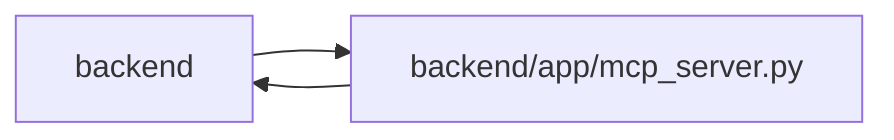

# mcp_server Module

**Path:** `backend/app/mcp_server.py`

## Description

MCP server facade for external LLM-agent integrations.

MCP uses the shared principal/project authority and command owner. Its established bearer actor-key format is validated and normalized before resolution; conflicting credentials remain rejected. Schedule preview selects a rollback context and returns structured version conflicts through the tool boundary.

## Imports

| Source | Symbols |
|--------|---------|
| `app` | `mcp_agent_tools` |
| `app.authority` | `AuthorityError` |
| `app.commands` | `command_transaction`, `AggregateVersionConflict`, `HierarchyScopeError`, `AggregateVersionConflict`, `HierarchyScopeError` |
| `app.config` | `get_settings` |
| `app.database` | `async_session_maker`, `close_database`, `init_db` |
| `app.maintenance` | `MaintenanceModeError`, `enforce_mcp_access` |
| `app.models.agent` | `AgentActor` |
| `app.services.agent_model_catalog_service` | `AgentModelConflictError` |
| `app.services.agent_routing_service` | `AgentRoutingConflictError` |
| `app.services.agent_service` | `AgentConflictError`, `AgentPermissionError`, `AgentService`, `actor_has_scope`, `require_scope` |
| `app.services.agent_team_setup_service` | `AgentTeamSetupConflictError` |
| `app.services.identity_service` | `IdentityService` |
| `app.services.task_service` | `TaskVersionConflictError` |
| `app.services.triage_service` | `TriageConflictError` |
| `argparse` | `argparse` |
| `asyncio` | `asyncio` |
| `contextlib` | `asynccontextmanager`, `redirect_stdout` |
| `contextvars` | `ContextVar` |
| `json` | `json` |
| `mcp.server.fastmcp` | `FastMCP` |
| `mcp.server.fastmcp.exceptions` | `ToolError` |
| `mcp.server.transport_security` | `TransportSecuritySettings` |
| `os` | `os` |
| `pydantic` | `ValidationError` |
| `starlette.responses` | `PlainTextResponse` |
| `starlette.routing` | `Route` |
| `starlette.types` | `ASGIApp`, `Receive`, `Scope`, `Send` |
| `sys` | `sys` |
| `typing` | `Any`, `AsyncIterator`, `Callable`, `Optional` |

## Local dependency map

<!-- Auto-generated local dependency summary. Do not edit by hand. -->

> Module-level dependencies exceed the generated-diagram limits, so the diagram and table below group them by top-level package. Counts report the number of module neighbors in each package.

### Internal neighbors

| Direction | Module |
|---|---|
| Inbound | `backend` (6) |
| Outbound | `backend` (14) |

### External packages

| Language | Used packages | Undeclared packages |
|---|---:|---:|
| python | 3 | 1 |

> All 20 module neighbor(s) are summarized by package because the module-level view exceeds the 12-node limit.

## Classes

| Class | Kind | Line | Bases / Target | Description |
|-------|------|------|----------------|-------------|
| [MCPAuthError](../entities/MCPAuthError.md) | Class | 46 | `PermissionError` | Raised when MCP agent authentication fails. |
| [MCPHostValidationMiddleware](../entities/MCPHostValidationMiddleware.md) | Class | 69 | — | Reject untrusted MCP Host/Origin values before database authentication. |
| [MCPAgentKeyMiddleware](../entities/MCPAgentKeyMiddleware.md) | Class | 104 | — | Extract and validate MCP HTTP agent credentials before protocol handling. |
| [MCPExactPathAlias](../entities/MCPExactPathAlias.md) | Class | 150 | — | Route exact MCP mount path requests into the Streamable HTTP root app. |
| [ScopeRequirement](../entities/ScopeRequirement.md) | Type alias | 216 | `Optional[str \| tuple[str, ...]]` | — |

## Functions

| Function | Signature | Decorators | Description |
|----------|-----------|------------|-------------|
| `_mcp_transport_security_settings` | `() -> TransportSecuritySettings` | — | Build the explicit Host/Origin allowlist shared by mounted and standalone MCP. |
| `_allowed_transport_value` | `(value: str, allowed_values: list[str]) -> bool` | — | — |
| `set_mcp_session_factory` | `(factory: Callable[[], Any]) -> None` | — | Override the DB session factory for tests. |
| `reset_mcp_session_factory` | `() -> None` | — | Restore the production DB session factory. |
| `_open_db_session` | *(async)* `() -> AsyncIterator[Any]` | `@asynccontextmanager` | Open a DB session from either production async factory or test override. |
| `_agent_key_from_scope` | `(scope: Scope) -> Optional[str]` | — | Extract agent API key from HTTP MCP headers. |
| `_current_agent_key` | `() -> Optional[str]` | — | Return the HTTP or stdio MCP agent key. |
| `_authenticate_agent_key` | *(async)* `(db: Any, api_key: str) -> AgentActor` | — | Authenticate a real agent actor and reject bootstrap execution. |
| `_skill_bundle_scope_requirement` | `() -> ScopeRequirement` | — | Match MCP skill delivery to the configured REST public/private mode. |
| `_require_scope_requirement` | `(actor: AgentActor, required: ScopeRequirement) -> None` | — | Require one scope or any scope from an explicit alternative set. |
| `_agent_context` | *(async)* `(required_scope: ScopeRequirement = None, *, preview = False) -> AsyncIterator[tuple[Any, AgentActor]]` | `@asynccontextmanager` | Open an authenticated MCP agent DB context. |
| `_structured_tool_error` | `(exc: Exception) -> str` | — | Return stable, machine-readable conflict and validation errors. |
| `_tool_call` | *(async)* `(required_scope: ScopeRequirement, func: Callable[[Any, AgentActor], Any], *, preview = False) -> Any` | — | Run a service-backed MCP tool and return MCP-safe errors. |
| `_json_resource` | *(async)* `(required_scope: ScopeRequirement, func: Callable[[Any, AgentActor], Any]) -> str` | — | Return a JSON resource payload through the authenticated MCP context. |
| `_skill_bundle_prompt` | *(async)* `(value: str) -> str` | — | Authenticate and authorize one role prompt under bundle delivery policy. |
| `create_mcp_server` | `() -> FastMCP` | — | Create the WorkChord FastMCP server. |
| `create_mcp_http_app` | `() -> ASGIApp` | — | Return the authenticated Streamable HTTP MCP ASGI app. |
| `mount_mcp_http` | `(app: Any, path: str) -> None` | — | Mount authenticated Streamable HTTP MCP at both `/path` and `/path/`. |
| `_run_standalone_transport` | *(async)* `(transport: str) -> None` | — | Run and dispose a standalone transport on one event loop. |
| `main` | `(argv: Optional[list[str]] = None) -> None` | — | Run the standalone MCP server. |
