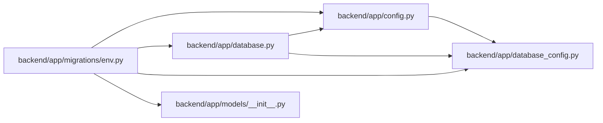

# env Module

**Path:** `backend/app/migrations/env.py`

## Description

Alembic environment configuration.

## Imports

| Source | Symbols |
|--------|---------|
| `alembic` | `context` |
| `app` | `models` |
| `app.config` | `get_settings` |
| `app.database` | `Base` |
| `app.database_config` | `alembic_safe_url`, `parse_database_configuration` |
| `logging.config` | `fileConfig` |
| `sqlalchemy` | `engine_from_config`, `pool` |

## Local dependency map

<!-- Auto-generated local dependency summary. Do not edit by hand. -->

### Internal neighbors

| Direction | Module |
|---|---|
| Outbound | [config](../modules/config.md) |
| Outbound | [app_database](../modules/app_database.md) |
| Outbound | [database_config](../modules/database_config.md) |
| Outbound | [models___init__](../modules/models___init__.md) |

### External packages

| Language | Used packages | Undeclared packages |
|---|---:|---:|
| python | 2 | 0 |

## Functions

| Function | Signature | Decorators | Description |
|----------|-----------|------------|-------------|
| `run_migrations_offline` | `() -> None` | — | Run migrations in offline mode. |
| `run_migrations_online` | `() -> None` | — | Run migrations in online mode. |
