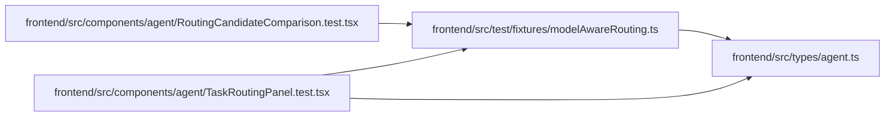

# modelAwareRouting Module

**Path:** `frontend/src/test/fixtures/modelAwareRouting.ts`

## Description

_Auto-generated from `frontend/src/test/fixtures/modelAwareRouting.ts`._

## Imports

| Source | Symbols |
|--------|---------|
| `../../types/agent` | `AgentActorRosterItem`, `AgentRoutingCandidate`, `AgentRoutingExclusion`, `AgentRoutingPreviewResponse` |

## Module Signals

| Signal | Values |
|--------|--------|
| Exports | `eligibleRoutingCandidate`, `excludedRoutingCandidate`, `modelAwareRoutingPreview`, `modelAwareRoutingRoster` |
| Constants | `eligibleRoutingCandidate`, `excludedRoutingCandidate`, `modelAwareRoutingPreview`, `modelAwareRoutingRoster` |

## Local dependency map

<!-- Auto-generated local dependency summary. Do not edit by hand. -->

### Internal neighbors

| Direction | Module |
|---|---|
| Inbound | [RoutingCandidateComparison.test](../modules/RoutingCandidateComparison.test.md) |
| Inbound | [TaskRoutingPanel.test](../modules/TaskRoutingPanel.test.md) |
| Outbound | [types_agent](../modules/types_agent.md) |
