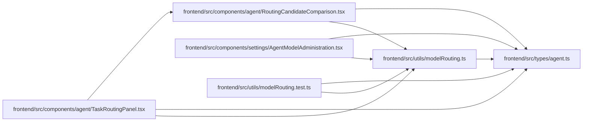

# modelRouting Module

**Path:** `frontend/src/utils/modelRouting.ts`

## Description

_Auto-generated from `frontend/src/utils/modelRouting.ts`._

## Imports

| Source | Symbols |
|--------|---------|
| `../types/agent` | `AgentCommandMetadata`, `TaskDifficultyAxes`, `TaskDifficultyBand`, `TaskReviewMode` |

## Module Signals

| Signal | Values |
|--------|--------|
| Exports | `ASSESSMENT_REASON_CODES`, `AssessmentReasonCode`, `MODEL_AWARE_ROUTING_FEATURE`, `createAgentCommandMetadata`, `deriveDifficultyBand`, `formatRoutingCode`, `minimumReviewMode`, `parseRoutingTags`, `reviewModeMeets`, `toAgentAuditRationale` |
| Constants | `MODEL_AWARE_ROUTING_FEATURE`, `ASSESSMENT_REASON_CODES`, `ADVANCED_REASON_CODES`, `INDEPENDENT_REASON_CODES`, `STANDARD_REVIEW_REASON_CODES`, `REVIEW_ORDER`, `AGENT_AUDIT_RATIONALE_MAX_LENGTH`, `AGENT_AUDIT_RATIONALE_FALLBACK` |
| Module calls | `ADVANCED_REASON_CODES = Set`, `INDEPENDENT_REASON_CODES = Set`, `STANDARD_REVIEW_REASON_CODES = Set` |

## Local dependency map

<!-- Auto-generated local dependency summary. Do not edit by hand. -->

### Internal neighbors

| Direction | Module |
|---|---|
| Inbound | [RoutingCandidateComparison](../modules/RoutingCandidateComparison.md) |
| Inbound | [TaskRoutingPanel](../modules/TaskRoutingPanel.md) |
| Inbound | [AgentModelAdministration](../modules/AgentModelAdministration.md) |
| Inbound | [modelRouting.test](../modules/modelRouting.test.md) |
| Outbound | [types_agent](../modules/types_agent.md) |

## Classes

| Class | Kind | Line | Bases / Target | Description |
|-------|------|------|----------------|-------------|
| [AssessmentReasonCode](../entities/modelRouting_AssessmentReasonCode.md) | Type alias | 25 | — | — |

## Functions

| Function | Signature | Decorators | Description |
|----------|-----------|------------|-------------|
| `deriveDifficultyBand` | `(axes: TaskDifficultyAxes, reasonCodes: readonly string[]) -> TaskDifficultyBand` | — | — |
| `minimumReviewMode` | `(axes: TaskDifficultyAxes, reasonCodes: readonly string[]) -> TaskReviewMode` | — | — |
| `reviewModeMeets` | `(actual: TaskReviewMode, minimum: TaskReviewMode)` | — | — |
| `parseRoutingTags` | `(value: string)` | — | — |
| `formatRoutingCode` | `(value: string)` | — | — |
| `toAgentAuditRationale` | `(rationale: string)` | — | — |
| `createAgentCommandMetadata` | `(rationale: string) -> AgentCommandMetadata` | — | — |
