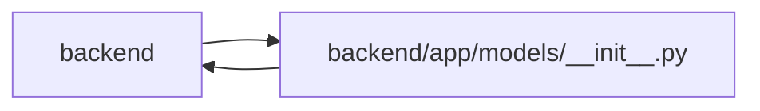

# __init__ Module

**Path:** `backend/app/models/__init__.py`

## Description

Models package.

Importing the recovery models registers the transactional task deletion hook alongside the model registry.

## Imports

| Source | Symbols |
|--------|---------|
| `app.models.agent` | `AgentActor`, `AgentIdempotencyRecord`, `AgentModelBinding`, `AgentModelCatalogEntry`, `AgentRun`, `AgentRunEvent`, `AgentTeamActionReceipt`, `AgentTeamApplyRun`, `AgentTeamManagedObject`, `AgentTeamTopology`, `AgentTeamTopologyMember`, `AgentTaskAssignment`, `ImmutableRoutingAssessmentError`, `TaskEvent`, `TaskRoutingAssessment` |
| `app.models.autonomy` | `AgentAutonomyTopology`, `AgentAutonomyTopologyMember`, `AgentObservationJob`, `AgentVerificationEvent`, `AgentVerificationRequirement`, `AgentWorkPackage`, `ImmutableAutonomyEventError` |
| `app.models.calendar` | `Calendar` |
| `app.models.capacity` | `PlanningState`, `ProfileAvailability`, `ProfileAbsence` |
| `app.models.database_migration` | `DatabaseMigrationGate` |
| `app.models.delivery_dependency` | `DeliveryDependency` |
| `app.models.discussion` | `TaskComment`, `TaskCommentRevision`, `TaskSubscription`, `InboxNotification` |
| `app.models.external_link` | `ExternalLink`, `ExternalLinkEntityType`, `ExternalLinkProvider` |
| `app.models.github` | `GitHubStatusAutomationRule` |
| `app.models.identity` | `Principal`, `IdentitySubject`, `WorkspaceMembership`, `ProjectMembership`, `PrincipalProfileLink`, `OIDCLoginAttempt`, `OwnershipTransfer`, `CommandAudit` |
| `app.models.iteration` | `Iteration` |
| `app.models.label` | `Label`, `LabelGroup` |
| `app.models.native_connection` | `NativeConnection` |
| `app.models.outbound_webhook` | `OutboundDeliveryChannel`, `OutboundWebhookDelivery`, `OutboundWebhookDeliveryStatus`, `OutboundWebhookEvent`, `OutboundWebhookTarget` |
| `app.models.plan_share` | `PlanShare` |
| `app.models.project` | `Initiative`, `Project`, `ProjectHealth`, `ProjectMilestone`, `ProjectMilestoneStatus`, `ProjectStatus`, `ProjectUpdateEntry` |
| `app.models.recovery` | `ApplicationSnapshot`, `LegacySnapshotImport`, `TaskScheduleBaseline`, `TaskDeletionFence` |
| `app.models.release` | `Release`, `ReleaseStatus`, `release_tasks` |
| `app.models.request_source` | `RequestSource`, `RequestSourceLink`, `RequestSourceType` |
| `app.models.saved_view` | `SavedView`, `SavedViewScope`, `SavedViewType` |
| `app.models.system_settings` | `SystemSetting` |
| `app.models.task` | `Task`, `TaskDependency`, `TaskStatus` |
| `app.models.task_brief` | `TaskBriefRevision`, `TaskProgressRecord`, `TaskReviewRecord` |
| `app.models.task_status_log` | `TaskStatusLog` |
| `app.models.team_member` | `TeamMember`, `TeamMemberProfile`, `TeamMemberProfileSkill`, `Vacation` |
| `app.models.template` | `TemplateType`, `WorkTemplate` |
| `app.models.triage` | `TriageClassificationSuggestion`, `TriageItem`, `TriageItemStatus` |
| `app.models.user_session` | `UserSession` |

## Local dependency map

<!-- Auto-generated local dependency summary. Do not edit by hand. -->

> Module-level dependencies exceed the generated-diagram limits, so the diagram and table below group them by top-level package. Counts report the number of module neighbors in each package.

### Internal neighbors

| Direction | Module |
|---|---|
| Inbound | `backend` (8) |
| Outbound | `backend` (28) |

> All 36 module neighbor(s) are summarized by package because the module-level view exceeds the 12-node limit.
