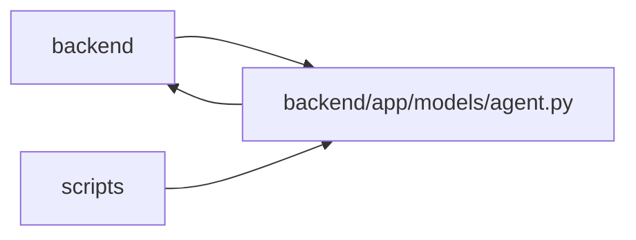

# agent Module

**Path:** `backend/app/models/agent.py`

## Description

Agent integration and tracing models.

## Imports

| Source | Symbols |
|--------|---------|
| `app.database` | `Base` |
| `app.models.project` | `ProjectUpdateEntry` |
| `app.models.task` | `Task` |
| `app.models.team_member` | `TeamMember`, `TeamMemberProfile` |
| `app.utils.time` | `UTCDateTime`, `utc_now` |
| `datetime` | `datetime` |
| `sqlalchemy` | `Boolean`, `CheckConstraint`, `Float`, `ForeignKey`, `Index`, `Integer`, `JSON`, `String`, `Text`, `UniqueConstraint`, `event`, `text` |
| `sqlalchemy.orm` | `Mapped`, `mapped_column`, `relationship` |
| `typing` | `TYPE_CHECKING`, `Any`, `Optional` |

## Local dependency map

<!-- Auto-generated local dependency summary. Do not edit by hand. -->

> Module-level dependencies exceed the generated-diagram limits, so the diagram and table below group them by top-level package. Counts report the number of module neighbors in each package.

### Internal neighbors

| Direction | Module |
|---|---|
| Inbound | `backend` (49) |
| Inbound | `scripts` (1) |
| Outbound | `backend` (5) |

### External packages

| Language | Used packages | Undeclared packages |
|---|---:|---:|
| python | 1 | 0 |

> All 52 module neighbor(s) are summarized by package because the module-level view exceeds the 12-node limit.

## Classes

| Class | Line | Bases | Description |
|-------|------|-------|-------------|
| [AgentActor](../entities/models_agent_AgentActor.md) | 30 | `Base` | Automated agent identity authorized to operate on tasks. |
| [AgentModelCatalogEntry](../entities/models_agent_AgentModelCatalogEntry.md) | 114 | `Base` | Secret-free provider-neutral model capability declaration. |
| [AgentModelBinding](../entities/models_agent_AgentModelBinding.md) | 188 | `Base` | Versioned runtime capability binding owned by one exact actor. |
| [AgentTeamTopology](../entities/AgentTeamTopology.md) | 284 | `Base` | Applied portable agent-team manifest and authoritative readiness state. |
| [AgentTeamTopologyMember](../entities/AgentTeamTopologyMember.md) | 356 | `Base` | Installation-local mapping from a portable actor key to one actor. |
| [AgentTeamManagedObject](../entities/AgentTeamManagedObject.md) | 499 | `Base` | Topology-local mapping for reusable profiles, catalogs, and bindings. |
| [AgentTeamApplyRun](../entities/AgentTeamApplyRun.md) | 555 | `Base` | Replay-safe setup command receipt with a resumable action plan. |
| [AgentTeamActionReceipt](../entities/models_agent_AgentTeamActionReceipt.md) | 651 | `Base` | Durable redacted result for one explicitly approved setup action. |
| [TaskRoutingAssessment](../entities/models_agent_TaskRoutingAssessment.md) | 708 | `Base` | Append-only routing assessment for one concrete task version. |
| [ImmutableRoutingAssessmentError](../entities/ImmutableRoutingAssessmentError.md) | 838 | `RuntimeError` | Raised when application code attempts to mutate append-only evidence. |
| [AgentTaskAssignment](../entities/models_agent_AgentTaskAssignment.md) | 850 | `Base` | Durable delegation of task execution or verification to one actor. |
| [AgentIdempotencyRecord](../entities/AgentIdempotencyRecord.md) | 955 | `Base` | Replay-safe record for agent and PM mutations. |
| [TaskEvent](../entities/TaskEvent.md) | 985 | `Base` | Append-only ledger entry for task mutations and agent checkpoints. |
| [AgentRun](../entities/models_agent_AgentRun.md) | 1031 | `Base` | Trace record for one automated agent execution. |
| [AgentRunEvent](../entities/models_agent_AgentRunEvent.md) | 1133 | `Base` | Append-only event emitted during an agent run. |

## Functions

| Function | Signature | Decorators | Description |
|----------|-----------|------------|-------------|
| `_reject_routing_assessment_mutation` | `(*_args: Any, **_kwargs: Any) -> None` | `@event.listens_for(TaskRoutingAssessment, 'before_update')`, `@event.listens_for(TaskRoutingAssessment, 'before_delete')` | — |
