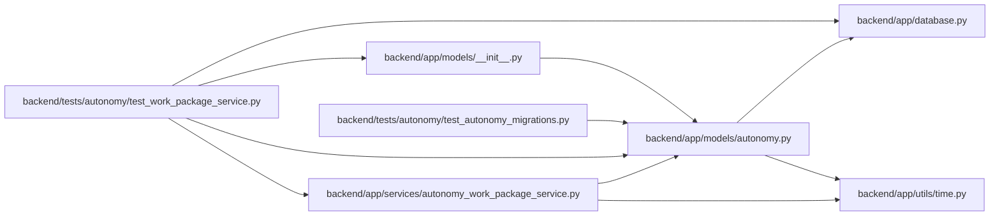

# autonomy Module

**Path:** `backend/app/models/autonomy.py`

## Description

WorkChord mirror models for autonomous topology and verification state.

## Imports

| Source | Symbols |
|--------|---------|
| `__future__` | `annotations` |
| `app.database` | `Base` |
| `app.utils.time` | `UTCDateTime`, `utc_now` |
| `datetime` | `datetime` |
| `sqlalchemy` | `CheckConstraint`, `ForeignKey`, `Index`, `Integer`, `String`, `Text`, `UniqueConstraint`, `event`, `text` |
| `sqlalchemy.orm` | `Mapped`, `mapped_column`, `relationship` |
| `typing` | `Any`, `Optional` |

## Local dependency map

<!-- Auto-generated local dependency summary. Do not edit by hand. -->

### Internal neighbors

| Direction | Module |
|---|---|
| Inbound | [models___init__](../modules/models___init__.md) |
| Inbound | [autonomy_work_package_service](../modules/autonomy_work_package_service.md) |
| Inbound | [test_autonomy_migrations](../modules/test_autonomy_migrations.md) |
| Inbound | [test_work_package_service](../modules/test_work_package_service.md) |
| Outbound | [app_database](../modules/app_database.md) |
| Outbound | [time](../modules/time.md) |

### External packages

| Language | Used packages | Undeclared packages |
|---|---:|---:|
| python | 1 | 0 |

## Classes

| Class | Line | Bases | Description |
|-------|------|-------|-------------|
| [AgentAutonomyTopology](../entities/AgentAutonomyTopology.md) | 25 | `Base` | Applied secret-free topology projection; external receipts stay authoritative. |
| [AgentAutonomyTopologyMember](../entities/AgentAutonomyTopologyMember.md) | 71 | `Base` | Stable logical-key to actor mapping and non-secret runtime readiness. |
| [AgentWorkPackage](../entities/AgentWorkPackage.md) | 128 | `Base` | Package aggregation is separate from the mutable execution task. |
| [AgentVerificationRequirement](../entities/AgentVerificationRequirement.md) | 187 | `Base` | One independently claimable verifier slot with a fenced lifecycle. |
| [AgentVerificationEvent](../entities/AgentVerificationEvent.md) | 273 | `Base` | Append-only verifier-slot event projection. |
| [AgentObservationJob](../entities/AgentObservationJob.md) | 314 | `Base` | Restart-safe bounded observation/retention job projection. |
| [ImmutableAutonomyEventError](../entities/ImmutableAutonomyEventError.md) | 372 | `RuntimeError` | — |

## Functions

| Function | Signature | Decorators | Description |
|----------|-----------|------------|-------------|
| `_reject_verification_event_mutation` | `(*_args: Any, **_kwargs: Any) -> None` | `@event.listens_for(AgentVerificationEvent, 'before_update')`, `@event.listens_for(AgentVerificationEvent, 'before_delete')` | — |
