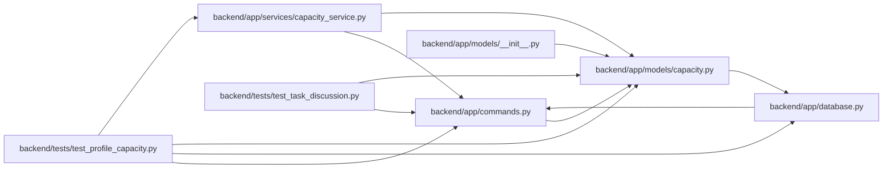

# capacity Module

**Path:** `backend/app/models/capacity.py`

## Description

Durable person availability and a serialization point for shared planning.

## Imports

| Source | Symbols |
|--------|---------|
| `app.database` | `Base` |
| `datetime` | `date` |
| `sqlalchemy` | `CheckConstraint`, `Date`, `ForeignKey`, `Integer`, `JSON`, `String` |
| `sqlalchemy.orm` | `Mapped`, `mapped_column` |

## Local dependency map

<!-- Auto-generated local dependency summary. Do not edit by hand. -->

### Internal neighbors

| Direction | Module |
|---|---|
| Inbound | [commands](../modules/commands.md) |
| Inbound | [models___init__](../modules/models___init__.md) |
| Inbound | [capacity_service](../modules/capacity_service.md) |
| Inbound | [test_profile_capacity](../modules/test_profile_capacity.md) |
| Inbound | [test_task_discussion](../modules/test_task_discussion.md) |
| Outbound | [app_database](../modules/app_database.md) |

### External packages

| Language | Used packages | Undeclared packages |
|---|---:|---:|
| python | 1 | 0 |

## Classes

| Class | Line | Bases | Description |
|-------|------|-------|-------------|
| [PlanningState](../entities/PlanningState.md) | 11 | `Base` | — |
| [ProfileAvailability](../entities/ProfileAvailability.md) | 19 | `Base` | — |
| [ProfileAbsence](../entities/ProfileAbsence.md) | 30 | `Base` | — |
