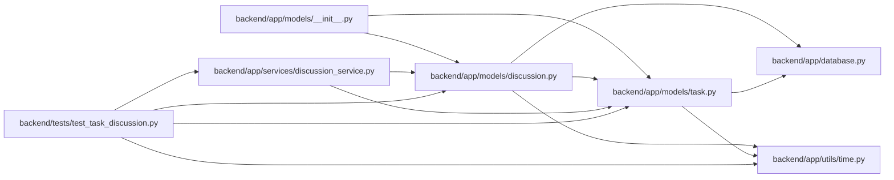

# discussion Module

**Path:** `backend/app/models/discussion.py`

## Description

Persists current comments, append-only revisions, per-person subscriptions and unique delivery receipts. Original task identifiers retain discussion through supported restoration; task deletion removes current foreign-key links without deleting revision history. Lifecycle and blockage changes collect transactional notification intents.

## Imports

| Source | Symbols |
|--------|---------|
| `app.database` | `Base` |
| `app.models.task` | `Task` |
| `app.utils.time` | `UTCDateTime`, `utc_now` |
| `datetime` | `datetime` |
| `sqlalchemy` | `CheckConstraint`, `ForeignKey`, `Integer`, `JSON`, `String`, `Text`, `UniqueConstraint`, `event`, `inspect` |
| `sqlalchemy.orm` | `Mapped`, `Session`, `mapped_column` |

## Local dependency map

<!-- Auto-generated local dependency summary. Do not edit by hand. -->

### Internal neighbors

| Direction | Module |
|---|---|
| Inbound | [models___init__](../modules/models___init__.md) |
| Inbound | [discussion_service](../modules/discussion_service.md) |
| Inbound | [test_task_discussion](../modules/test_task_discussion.md) |
| Outbound | [app_database](../modules/app_database.md) |
| Outbound | [models_task](../modules/models_task.md) |
| Outbound | [time](../modules/time.md) |

### External packages

| Language | Used packages | Undeclared packages |
|---|---:|---:|
| python | 1 | 0 |

## Classes

| Class | Line | Bases | Description |
|-------|------|-------|-------------|
| [TaskComment](../entities/models_discussion_TaskComment.md) | 12 | `Base` | — |
| [TaskCommentRevision](../entities/TaskCommentRevision.md) | 27 | `Base` | — |
| [TaskSubscription](../entities/TaskSubscription.md) | 41 | `Base` | — |
| [InboxNotification](../entities/InboxNotification.md) | 50 | `Base` | — |

## Functions

| Function | Signature | Decorators | Description |
|----------|-----------|------------|-------------|
| `prevent_comment_history_rewrite` | `(state)` | `@event.listens_for(Session, 'do_orm_execute')` | — |
| `protect_discussion_history` | `(session, _flush_context, _instances)` | `@event.listens_for(Session, 'before_flush')` | — |
