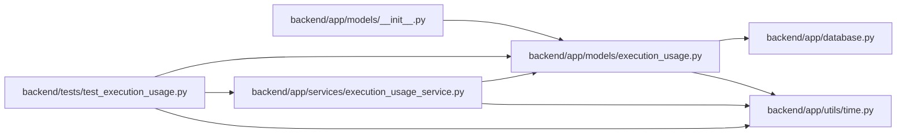

# execution_usage Module

**Path:** `backend/app/models/execution_usage.py`

## Description

Per-attempt revisions preserve report payloads, digests, pricing snapshots and original identities. Current totals use the latest explicit correction rather than summing repeated attempt totals. Scope references detach on deletion while original identifiers remain historical evidence; a run identity distinguishes attempts from legacy numeric-ID reuse.

Append-only per-attempt usage report revisions and pricing evidence.

## Imports

| Source | Symbols |
|--------|---------|
| `app.database` | `Base` |
| `app.utils.time` | `UTCDateTime`, `utc_now` |
| `datetime` | `datetime` |
| `sqlalchemy` | `ForeignKey`, `Index`, `Integer`, `JSON`, `String`, `UniqueConstraint`, `event` |
| `sqlalchemy.orm` | `Mapped`, `mapped_column` |

## Local dependency map

<!-- Auto-generated local dependency summary. Do not edit by hand. -->

### Internal neighbors

| Direction | Module |
|---|---|
| Inbound | [models___init__](../modules/models___init__.md) |
| Inbound | [execution_usage_service](../modules/execution_usage_service.md) |
| Inbound | [test_execution_usage](../modules/test_execution_usage.md) |
| Outbound | [app_database](../modules/app_database.md) |
| Outbound | [time](../modules/time.md) |

### External packages

| Language | Used packages | Undeclared packages |
|---|---:|---:|
| python | 1 | 0 |

## Classes

| Class | Line | Bases | Description |
|-------|------|-------|-------------|
| [ExecutionUsageRecord](../entities/ExecutionUsageRecord.md) | 11 | `Base` | — |

## Functions

| Function | Signature | Decorators | Description |
|----------|-----------|------------|-------------|
| `immutable_usage` | `(*_args)` | — | — |
