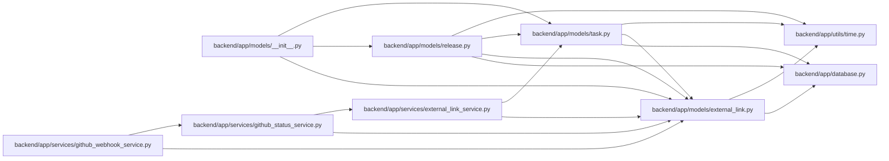

# external_link Module

**Path:** `backend/app/models/external_link.py`

## Description

External link model for delivery traceability.

## Imports

| Source | Symbols |
|--------|---------|
| `app.database` | `Base` |
| `app.utils.time` | `UTCDateTime`, `utc_now` |
| `datetime` | `datetime` |
| `enum` | `Enum` |
| `sqlalchemy` | `CheckConstraint`, `Index`, `Integer`, `JSON`, `String` |
| `sqlalchemy.orm` | `Mapped`, `mapped_column` |
| `typing` | `Any`, `Optional` |

## Local dependency map

<!-- Auto-generated local dependency summary. Do not edit by hand. -->

### Internal neighbors

| Direction | Module |
|---|---|
| Inbound | [models___init__](../modules/models___init__.md) |
| Inbound | [models_release](../modules/models_release.md) |
| Inbound | [models_task](../modules/models_task.md) |
| Inbound | [external_link_service](../modules/external_link_service.md) |
| Inbound | [github_status_service](../modules/github_status_service.md) |
| Inbound | [github_webhook_service](../modules/github_webhook_service.md) |
| Outbound | [app_database](../modules/app_database.md) |
| Outbound | [time](../modules/time.md) |

### External packages

| Language | Used packages | Undeclared packages |
|---|---:|---:|
| python | 1 | 0 |

## Classes

| Class | Kind | Line | Bases / Target | Description |
|-------|------|------|----------------|-------------|
| [ExternalLinkEntityType](../entities/models_external_link_ExternalLinkEntityType.md) | Enum | 13 | `str`, `Enum` | Supported internal entity types for external links. |
| [ExternalLinkProvider](../entities/models_external_link_ExternalLinkProvider.md) | Enum | 20 | `str`, `Enum` | Supported external link providers. |
| [ExternalLink](../entities/models_external_link_ExternalLink.md) | Class | 29 | `Base` | Generic link from an internal entity to an external delivery artifact. |
