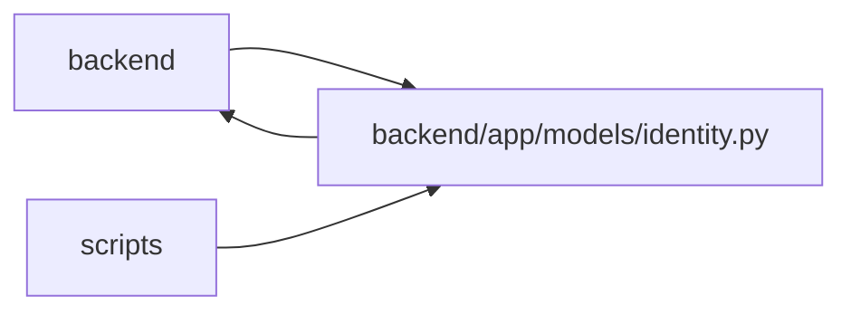

# identity Module

**Path:** `backend/app/models/identity.py`

## Description

Durable authentication subjects, scoped authority and attributable ownership.

Durable human/agent/system principals, unique issuer/subject mappings, memberships, profile ownership, login attempts and ownership/audit records separate authenticated authority from anonymous attribution and iteration capacity. The explicit repair initializer owns control-plane setup; schema-only transfer destinations remain empty.

## Imports

| Source | Symbols |
|--------|---------|
| `app.database` | `Base` |
| `app.utils.time` | `UTCDateTime`, `utc_now` |
| `datetime` | `datetime` |
| `sqlalchemy` | `Boolean`, `CheckConstraint`, `ForeignKey`, `Integer`, `JSON`, `String`, `Text`, `UniqueConstraint` |
| `sqlalchemy.orm` | `Mapped`, `mapped_column` |

## Local dependency map

<!-- Auto-generated local dependency summary. Do not edit by hand. -->

> Module-level dependencies exceed the generated-diagram limits, so the diagram and table below group them by top-level package. Counts report the number of module neighbors in each package.

### Internal neighbors

| Direction | Module |
|---|---|
| Inbound | `backend` (22) |
| Inbound | `scripts` (2) |
| Outbound | `backend` (2) |

### External packages

| Language | Used packages | Undeclared packages |
|---|---:|---:|
| python | 1 | 0 |

> All 26 module neighbor(s) are summarized by package because the module-level view exceeds the 12-node limit.

## Classes

| Class | Line | Bases | Description |
|-------|------|-------|-------------|
| [Principal](../entities/Principal.md) | 12 | `Base` | — |
| [IdentitySubject](../entities/IdentitySubject.md) | 23 | `Base` | — |
| [WorkspaceMembership](../entities/WorkspaceMembership.md) | 33 | `Base` | — |
| [WorkspaceAuthorityState](../entities/WorkspaceAuthorityState.md) | 41 | `Base` | — |
| [ProjectMembership](../entities/ProjectMembership.md) | 49 | `Base` | — |
| [PrincipalProfileLink](../entities/PrincipalProfileLink.md) | 58 | `Base` | — |
| [OIDCLoginAttempt](../entities/OIDCLoginAttempt.md) | 66 | `Base` | — |
| [OwnershipTransfer](../entities/OwnershipTransfer.md) | 77 | `Base` | — |
| [CommandAudit](../entities/CommandAudit.md) | 86 | `Base` | — |