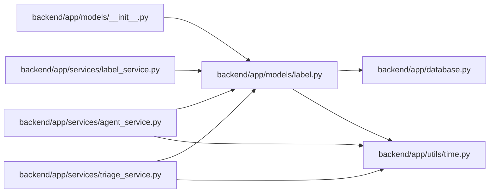

# label Module

**Path:** `backend/app/models/label.py`

## Description

Governed label taxonomy models.

## Imports

| Source | Symbols |
|--------|---------|
| `app.database` | `Base` |
| `app.utils.time` | `UTCDateTime`, `utc_now` |
| `datetime` | `datetime` |
| `sqlalchemy` | `Boolean`, `ForeignKey`, `Integer`, `String`, `Text`, `UniqueConstraint` |
| `sqlalchemy.orm` | `Mapped`, `mapped_column`, `relationship` |
| `typing` | `Optional` |

## Local dependency map

<!-- Auto-generated local dependency summary. Do not edit by hand. -->

### Internal neighbors

| Direction | Module |
|---|---|
| Inbound | [models___init__](../modules/models___init__.md) |
| Inbound | [agent_service](../modules/agent_service.md) |
| Inbound | [label_service](../modules/label_service.md) |
| Inbound | [triage_service](../modules/triage_service.md) |
| Outbound | [app_database](../modules/app_database.md) |
| Outbound | [time](../modules/time.md) |

### External packages

| Language | Used packages | Undeclared packages |
|---|---:|---:|
| python | 1 | 0 |

## Classes

| Class | Line | Bases | Description |
|-------|------|-------|-------------|
| [LabelGroup](../entities/models_label_LabelGroup.md) | 12 | `Base` | A governed group for related task label slugs. |
| [Label](../entities/models_label_Label.md) | 44 | `Base` | A governed label slug compatible with existing task tag strings. |
