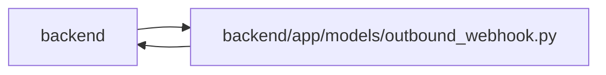

# outbound_webhook Module

**Path:** `backend/app/models/outbound_webhook.py`

## Description

Outbound webhook configuration and delivery log models.

## Imports

| Source | Symbols |
|--------|---------|
| `app.database` | `Base` |
| `app.utils.time` | `UTCDateTime`, `utc_now` |
| `datetime` | `datetime` |
| `enum` | `Enum` |
| `sqlalchemy` | `CheckConstraint`, `ForeignKey`, `Index`, `Integer`, `JSON`, `String`, `Text`, `UniqueConstraint` |
| `sqlalchemy.orm` | `Mapped`, `mapped_column`, `relationship` |
| `typing` | `Any`, `Optional` |

## Local dependency map

<!-- Auto-generated local dependency summary. Do not edit by hand. -->

> Module-level dependencies exceed the generated-diagram limits, so the diagram and table below group them by top-level package. Counts report the number of module neighbors in each package.

### Internal neighbors

| Direction | Module |
|---|---|
| Inbound | `backend` (11) |
| Outbound | `backend` (2) |

### External packages

| Language | Used packages | Undeclared packages |
|---|---:|---:|
| python | 1 | 0 |

> All 13 module neighbor(s) are summarized by package because the module-level view exceeds the 12-node limit.

## Classes

| Class | Kind | Line | Bases / Target | Description |
|-------|------|------|----------------|-------------|
| [OutboundWebhookDeliveryStatus](../entities/models_outbound_webhook_OutboundWebhookDeliveryStatus.md) | Enum | 21 | `str`, `Enum` | Delivery states for outbound webhook attempts. |
| [OutboundDeliveryChannel](../entities/OutboundDeliveryChannel.md) | Enum | 29 | `str`, `Enum` | Transport selected by the durable outbound delivery worker. |
| [OutboundWebhookTarget](../entities/models_outbound_webhook_OutboundWebhookTarget.md) | Class | 37 | `Base` | Configurable subscriber for outbound domain events. |
| [OutboundWebhookEvent](../entities/models_outbound_webhook_OutboundWebhookEvent.md) | Class | 80 | `Base` | Normalized domain event available for webhook delivery. |
| [OutboundWebhookDelivery](../entities/models_outbound_webhook_OutboundWebhookDelivery.md) | Class | 115 | `Base` | One delivery attempt log for one target and event. |
