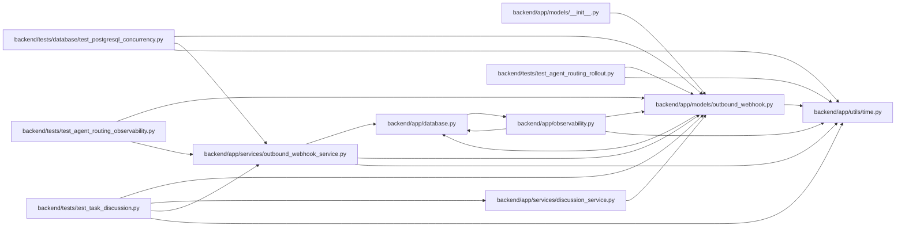

# outbound_webhook Module

**Path:** `backend/app/models/outbound_webhook.py`

## Description

Outbound webhook configuration and delivery log models.

## Imports

| Source | Symbols |
|--------|---------|
| `app.database` | `Base` |
| `app.utils.time` | `UTCDateTime`, `utc_now` |
| `datetime` | `datetime` |
| `enum` | `Enum` |
| `sqlalchemy` | `CheckConstraint`, `ForeignKey`, `Index`, `Integer`, `JSON`, `String`, `Text`, `UniqueConstraint` |
| `sqlalchemy.orm` | `Mapped`, `mapped_column`, `relationship` |
| `typing` | `Any`, `Optional` |

## Local dependency map

<!-- Auto-generated local dependency summary. Do not edit by hand. -->

### Internal neighbors

| Direction | Module |
|---|---|
| Inbound | [models___init__](../modules/models___init__.md) |
| Inbound | [observability](../modules/observability.md) |
| Inbound | [discussion_service](../modules/discussion_service.md) |
| Inbound | [outbound_webhook_service](../modules/outbound_webhook_service.md) |
| Inbound | [test_postgresql_concurrency](../modules/test_postgresql_concurrency.md) |
| Inbound | [test_agent_routing_observability](../modules/test_agent_routing_observability.md) |
| Inbound | [test_agent_routing_rollout](../modules/test_agent_routing_rollout.md) |
| Inbound | [test_task_discussion](../modules/test_task_discussion.md) |
| Outbound | [app_database](../modules/app_database.md) |
| Outbound | [time](../modules/time.md) |

### External packages

| Language | Used packages | Undeclared packages |
|---|---:|---:|
| python | 1 | 0 |

## Classes

| Class | Kind | Line | Bases / Target | Description |
|-------|------|------|----------------|-------------|
| [OutboundWebhookDeliveryStatus](../entities/models_outbound_webhook_OutboundWebhookDeliveryStatus.md) | Enum | 21 | `str`, `Enum` | Delivery states for outbound webhook attempts. |
| [OutboundDeliveryChannel](../entities/OutboundDeliveryChannel.md) | Enum | 29 | `str`, `Enum` | Transport selected by the durable outbound delivery worker. |
| [OutboundWebhookTarget](../entities/models_outbound_webhook_OutboundWebhookTarget.md) | Class | 37 | `Base` | Configurable subscriber for outbound domain events. |
| [OutboundWebhookEvent](../entities/models_outbound_webhook_OutboundWebhookEvent.md) | Class | 80 | `Base` | Normalized domain event available for webhook delivery. |
| [OutboundWebhookDelivery](../entities/models_outbound_webhook_OutboundWebhookDelivery.md) | Class | 115 | `Base` | One delivery attempt log for one target and event. |
