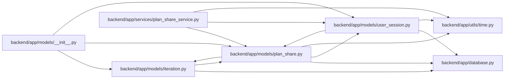

# plan_share Module

**Path:** `backend/app/models/plan_share.py`

## Description

Immutable read-only plan snapshots shared through revocable links.

## Imports

| Source | Symbols |
|--------|---------|
| `app.database` | `Base` |
| `app.models.iteration` | `Iteration` |
| `app.models.user_session` | `UserSession` |
| `app.utils.time` | `UTCDateTime`, `utc_now` |
| `datetime` | `datetime` |
| `sqlalchemy` | `ForeignKey`, `Index`, `Integer`, `JSON`, `String` |
| `sqlalchemy.orm` | `Mapped`, `mapped_column`, `relationship` |
| `typing` | `TYPE_CHECKING`, `Any` |

## Local dependency map

<!-- Auto-generated local dependency summary. Do not edit by hand. -->

### Internal neighbors

| Direction | Module |
|---|---|
| Inbound | [models___init__](../modules/models___init__.md) |
| Inbound | [models_iteration](../modules/models_iteration.md) |
| Inbound | [user_session](../modules/user_session.md) |
| Inbound | [plan_share_service](../modules/plan_share_service.md) |
| Outbound | [app_database](../modules/app_database.md) |
| Outbound | [models_iteration](../modules/models_iteration.md) |
| Outbound | [user_session](../modules/user_session.md) |
| Outbound | [time](../modules/time.md) |

### External packages

| Language | Used packages | Undeclared packages |
|---|---:|---:|
| python | 1 | 0 |

## Classes

| Class | Line | Bases | Description |
|-------|------|-------|-------------|
| [PlanShare](../entities/models_plan_share_PlanShare.md) | 17 | `Base` | One immutable iteration plan snapshot owned by a browser session. |
