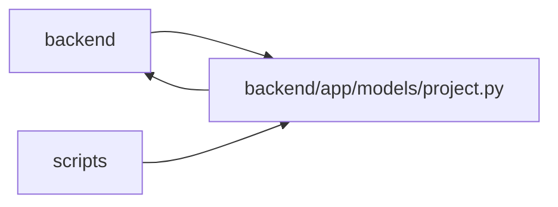

# project Module

**Path:** `backend/app/models/project.py`

## Description

Project model.

## Imports

| Source | Symbols |
|--------|---------|
| `app.database` | `Base` |
| `app.models.agent` | `AgentActor` |
| `app.models.iteration` | `Iteration` |
| `app.models.release` | `Release` |
| `app.models.request_source` | `RequestSourceLink` |
| `app.models.task` | `Task` |
| `app.models.team_member` | `TeamMember`, `TeamMemberProfile` |
| `app.models.user_session` | `UserSession` |
| `app.utils.time` | `UTCDateTime`, `utc_now` |
| `datetime` | `date`, `datetime` |
| `enum` | `Enum` |
| `sqlalchemy` | `CheckConstraint`, `Date`, `ForeignKey`, `Index`, `Integer`, `JSON`, `String`, `Text` |
| `sqlalchemy.orm` | `Mapped`, `mapped_column`, `relationship` |
| `typing` | `TYPE_CHECKING`, `Optional` |

## Local dependency map

<!-- Auto-generated local dependency summary. Do not edit by hand. -->

> Module-level dependencies exceed the generated-diagram limits, so the diagram and table below group them by top-level package. Counts report the number of module neighbors in each package.

### Internal neighbors

| Direction | Module |
|---|---|
| Inbound | `backend` (40) |
| Inbound | `scripts` (1) |
| Outbound | `backend` (9) |

### External packages

| Language | Used packages | Undeclared packages |
|---|---:|---:|
| python | 1 | 0 |

> All 43 module neighbor(s) are summarized by package because the module-level view exceeds the 12-node limit.

## Classes

| Class | Kind | Line | Bases / Target | Description |
|-------|------|------|----------------|-------------|
| [ProjectStatus](../entities/models_project_ProjectStatus.md) | Enum | 22 | `str`, `Enum` | Project lifecycle status. |
| [ProjectHealth](../entities/models_project_ProjectHealth.md) | Enum | 32 | `str`, `Enum` | Project delivery health. |
| [ProjectMilestoneStatus](../entities/models_project_ProjectMilestoneStatus.md) | Enum | 40 | `str`, `Enum` | Explicit lifecycle status for a project milestone. |
| [Initiative](../entities/models_project_Initiative.md) | Class | 48 | `Base` | Strategic goal that groups related projects on the roadmap. |
| [Project](../entities/models_project_Project.md) | Class | 103 | `Base` | Outcome-oriented planning container above tasks and iterations. |
| [ProjectUpdateEntry](../entities/models_project_ProjectUpdateEntry.md) | Class | 191 | `Base` | Append-only structured status update for a project. |
| [ProjectMilestone](../entities/models_project_ProjectMilestone.md) | Class | 248 | `Base` | Manually ordered milestone for a single project roadmap. |
