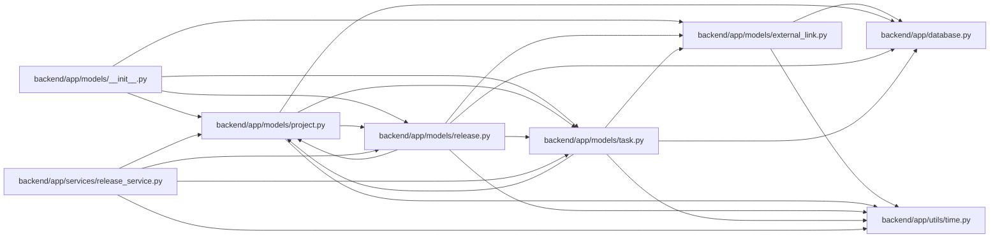

# release Module

**Path:** `backend/app/models/release.py`

## Description

Release model for shipped-work tracking.

## Imports

| Source | Symbols |
|--------|---------|
| `app.database` | `Base` |
| `app.models.external_link` | `ExternalLink` |
| `app.models.project` | `Project` |
| `app.models.task` | `Task` |
| `app.utils.time` | `UTCDateTime`, `utc_now` |
| `datetime` | `date`, `datetime` |
| `enum` | `Enum` |
| `sqlalchemy` | `CheckConstraint`, `Column`, `Date`, `ForeignKey`, `Index`, `Integer`, `String`, `Table`, `Text`, `and_` |
| `sqlalchemy.orm` | `Mapped`, `foreign`, `mapped_column`, `relationship` |
| `typing` | `TYPE_CHECKING`, `Optional` |

## Local dependency map

<!-- Auto-generated local dependency summary. Do not edit by hand. -->

### Internal neighbors

| Direction | Module |
|---|---|
| Inbound | [models___init__](../modules/models___init__.md) |
| Inbound | [models_project](../modules/models_project.md) |
| Inbound | [release_service](../modules/release_service.md) |
| Outbound | [app_database](../modules/app_database.md) |
| Outbound | [models_external_link](../modules/models_external_link.md) |
| Outbound | [models_project](../modules/models_project.md) |
| Outbound | [models_task](../modules/models_task.md) |
| Outbound | [time](../modules/time.md) |

### External packages

| Language | Used packages | Undeclared packages |
|---|---:|---:|
| python | 1 | 0 |

## Classes

| Class | Kind | Line | Bases / Target | Description |
|-------|------|------|----------------|-------------|
| [ReleaseStatus](../entities/models_release_ReleaseStatus.md) | Enum | 29 | `str`, `Enum` | Release lifecycle independent of task status. |
| [Release](../entities/models_release_Release.md) | Class | 60 | `Base` | Lightweight shipping record scoped to one project. |
