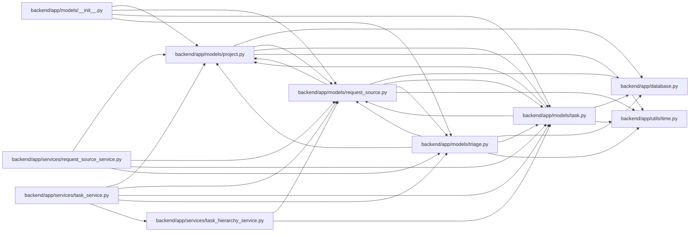

# request_source Module

**Path:** `backend/app/models/request_source.py`

## Description

Request source models for customer and intake traceability.

## Imports

| Source | Symbols |
|--------|---------|
| `app.database` | `Base` |
| `app.models.project` | `Project` |
| `app.models.task` | `Task` |
| `app.models.triage` | `TriageItem` |
| `app.utils.time` | `UTCDateTime`, `utc_now` |
| `datetime` | `datetime` |
| `enum` | `Enum` |
| `sqlalchemy` | `CheckConstraint`, `ForeignKey`, `Index`, `Integer`, `String`, `Text`, `UniqueConstraint` |
| `sqlalchemy.orm` | `Mapped`, `mapped_column`, `relationship` |
| `typing` | `Optional`, `TYPE_CHECKING` |

## Local dependency map

<!-- Auto-generated local dependency summary. Do not edit by hand. -->

### Internal neighbors

| Direction | Module |
|---|---|
| Inbound | [models___init__](../modules/models___init__.md) |
| Inbound | [models_project](../modules/models_project.md) |
| Inbound | [models_task](../modules/models_task.md) |
| Inbound | [models_triage](../modules/models_triage.md) |
| Inbound | [request_source_service](../modules/request_source_service.md) |
| Inbound | [task_hierarchy_service](../modules/task_hierarchy_service.md) |
| Inbound | [task_service](../modules/task_service.md) |
| Outbound | [app_database](../modules/app_database.md) |
| Outbound | [models_project](../modules/models_project.md) |
| Outbound | [models_task](../modules/models_task.md) |
| Outbound | [models_triage](../modules/models_triage.md) |
| Outbound | [time](../modules/time.md) |

### External packages

| Language | Used packages | Undeclared packages |
|---|---:|---:|
| python | 1 | 0 |

## Classes

| Class | Kind | Line | Bases / Target | Description |
|-------|------|------|----------------|-------------|
| [RequestSourceType](../entities/models_request_source_RequestSourceType.md) | Enum | 26 | `str`, `Enum` | Supported lightweight request intake source types. |
| [RequestSource](../entities/models_request_source_RequestSource.md) | Class | 37 | `Base` | Free-text source record that can be linked to work entities. |
| [RequestSourceLink](../entities/models_request_source_RequestSourceLink.md) | Class | 76 | `Base` | Link from one request source to exactly one supported target. |
