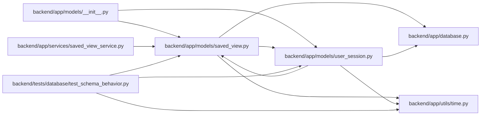

# saved_view Module

**Path:** `backend/app/models/saved_view.py`

## Description

Saved view model for reusable list and dashboard filters.

## Imports

| Source | Symbols |
|--------|---------|
| `app.database` | `Base` |
| `app.models.user_session` | `UserSession` |
| `app.utils.time` | `UTCDateTime`, `utc_now` |
| `datetime` | `datetime` |
| `enum` | `Enum` |
| `sqlalchemy` | `CheckConstraint`, `ForeignKey`, `Integer`, `JSON`, `String`, `Text` |
| `sqlalchemy.orm` | `Mapped`, `mapped_column`, `relationship` |
| `typing` | `TYPE_CHECKING`, `Any`, `Optional` |

## Local dependency map

<!-- Auto-generated local dependency summary. Do not edit by hand. -->

### Internal neighbors

| Direction | Module |
|---|---|
| Inbound | [models___init__](../modules/models___init__.md) |
| Inbound | [user_session](../modules/user_session.md) |
| Inbound | [saved_view_service](../modules/saved_view_service.md) |
| Inbound | [test_schema_behavior](../modules/test_schema_behavior.md) |
| Outbound | [app_database](../modules/app_database.md) |
| Outbound | [user_session](../modules/user_session.md) |
| Outbound | [time](../modules/time.md) |

### External packages

| Language | Used packages | Undeclared packages |
|---|---:|---:|
| python | 1 | 0 |

## Classes

| Class | Kind | Line | Bases / Target | Description |
|-------|------|------|----------------|-------------|
| [SavedViewType](../entities/models_saved_view_SavedViewType.md) | Enum | 16 | `str`, `Enum` | Surface that a saved view applies to. |
| [SavedViewScope](../entities/models_saved_view_SavedViewScope.md) | Enum | 23 | `str`, `Enum` | Visibility scope for a saved view. |
| [SavedView](../entities/models_saved_view_SavedView.md) | Class | 30 | `Base` | Persisted filter, sort, and column configuration for reusable views. |
