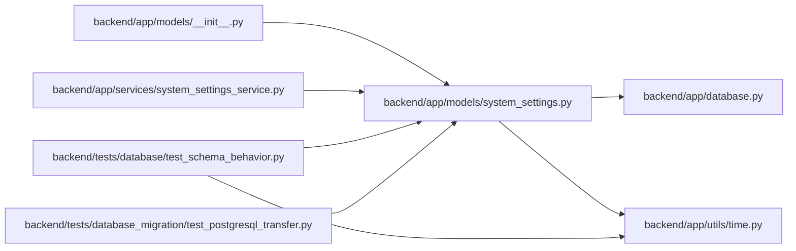

# system_settings Module

**Path:** `backend/app/models/system_settings.py`

## Description

Runtime system settings model.

## Imports

| Source | Symbols |
|--------|---------|
| `app.database` | `Base` |
| `app.utils.time` | `UTCDateTime`, `utc_now` |
| `datetime` | `datetime` |
| `sqlalchemy` | `Boolean`, `Index`, `Integer`, `JSON`, `String`, `Text`, `UniqueConstraint` |
| `sqlalchemy.orm` | `Mapped`, `mapped_column` |
| `typing` | `Any`, `Optional` |

## Local dependency map

<!-- Auto-generated local dependency summary. Do not edit by hand. -->

### Internal neighbors

| Direction | Module |
|---|---|
| Inbound | [models___init__](../modules/models___init__.md) |
| Inbound | [system_settings_service](../modules/system_settings_service.md) |
| Inbound | [test_schema_behavior](../modules/test_schema_behavior.md) |
| Inbound | [test_postgresql_transfer](../modules/test_postgresql_transfer.md) |
| Outbound | [app_database](../modules/app_database.md) |
| Outbound | [time](../modules/time.md) |

### External packages

| Language | Used packages | Undeclared packages |
|---|---:|---:|
| python | 1 | 0 |

## Classes

| Class | Line | Bases | Description |
|-------|------|-------|-------------|
| [SystemSetting](../entities/SystemSetting.md) | 12 | `Base` | One catalogued runtime configuration value. |
