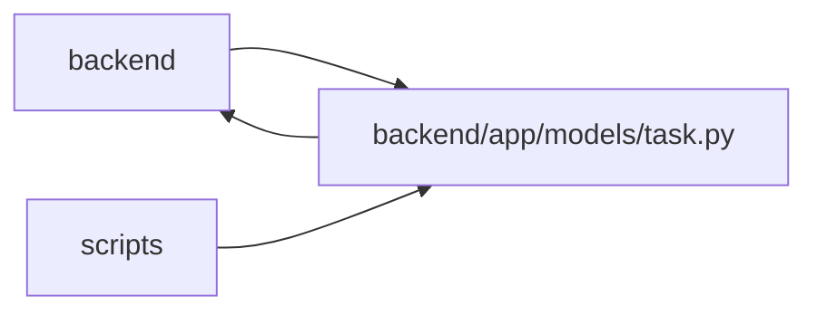

# task Module

**Path:** `backend/app/models/task.py`

## Description

Task model.

Tasks retain the four lifecycle values and a valid project or iteration scope. Durable human ownership is separate from iteration capacity and execution principals. Hours are the authoritative nullable estimate; display days derive from the nominal calendar day. Blocking, cancellation, manual execution, canonical briefs and current evidence are explicit projections, while accepted work remains tied to its task version.

## Imports

| Source | Symbols |
|--------|---------|
| `app.database` | `Base` |
| `app.models.agent` | `AgentActor`, `AgentRun`, `AgentTaskAssignment`, `TaskEvent`, `TaskRoutingAssessment` |
| `app.models.external_link` | `ExternalLink`, `ExternalLink` |
| `app.models.iteration` | `Iteration` |
| `app.models.project` | `Project`, `ProjectMilestone` |
| `app.models.request_source` | `RequestSourceLink` |
| `app.models.task_status_log` | `TaskStatusLog` |
| `app.models.team_member` | `TeamMember`, `TeamMemberProfile` |
| `app.utils.time` | `UTCDateTime`, `utc_now` |
| `datetime` | `date`, `datetime` |
| `enum` | `Enum` |
| `sqlalchemy` | `CheckConstraint`, `Date`, `Float`, `ForeignKey`, `Integer`, `JSON`, `String`, `Text`, `and_`, `false` |
| `sqlalchemy.ext.hybrid` | `hybrid_property` |
| `sqlalchemy.orm` | `Mapped`, `foreign`, `mapped_column`, `relationship` |
| `typing` | `TYPE_CHECKING`, `Optional` |

## Local dependency map

<!-- Auto-generated local dependency summary. Do not edit by hand. -->

> Module-level dependencies exceed the generated-diagram limits, so the diagram and table below group them by top-level package. Counts report the number of module neighbors in each package.

### Internal neighbors

| Direction | Module |
|---|---|
| Inbound | `backend` (81) |
| Inbound | `scripts` (3) |
| Outbound | `backend` (9) |

### External packages

| Language | Used packages | Undeclared packages |
|---|---:|---:|
| python | 1 | 0 |

> All 87 module neighbor(s) are summarized by package because the module-level view exceeds the 12-node limit.

## Classes

| Class | Kind | Line | Bases / Target | Description |
|-------|------|------|----------------|-------------|
| [TaskStatus](../entities/models_task_TaskStatus.md) | Enum | 30 | `str`, `Enum` | Task status enumeration for work tracking. |
| [Task](../entities/models_task_Task.md) | Class | 45 | `Base` | Task model with tree structure and dependencies. |
| [TaskDependency](../entities/TaskDependency.md) | Class | 257 | `Base` | Task dependency relationship (including cross-parent subtask dependencies). |