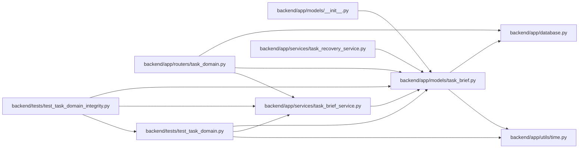

# task_brief Module

**Path:** `backend/app/models/task_brief.py`

## Description

Append-only brief, progress and ordinary review history.

These records describe task collaboration. Autonomous work-package verification
continues to require its own trusted evidence and fenced verifier protocol.

Brief revisions, criterion progress and review verdicts are append-only records. Original task IDs preserve historical identity when a task is removed; current links may become null. These collaboration records do not replace the trusted autonomous work-package verification protocol.

## Imports

| Source | Symbols |
|--------|---------|
| `app.database` | `Base` |
| `app.utils.time` | `UTCDateTime`, `utc_now` |
| `datetime` | `datetime` |
| `sqlalchemy` | `ForeignKey`, `Integer`, `JSON`, `String`, `Text`, `UniqueConstraint`, `event` |
| `sqlalchemy.orm` | `Mapped`, `mapped_column` |

## Local dependency map

<!-- Auto-generated local dependency summary. Do not edit by hand. -->

### Internal neighbors

| Direction | Module |
|---|---|
| Inbound | [models___init__](../modules/models___init__.md) |
| Inbound | [routers_task_domain](../modules/routers_task_domain.md) |
| Inbound | [task_brief_service](../modules/task_brief_service.md) |
| Inbound | [task_recovery_service](../modules/task_recovery_service.md) |
| Inbound | [test_task_domain](../modules/test_task_domain.md) |
| Inbound | [test_task_domain_integrity](../modules/test_task_domain_integrity.md) |
| Outbound | [app_database](../modules/app_database.md) |
| Outbound | [time](../modules/time.md) |

### External packages

| Language | Used packages | Undeclared packages |
|---|---:|---:|
| python | 1 | 0 |

## Classes

| Class | Line | Bases | Description |
|-------|------|-------|-------------|
| [TaskBriefRevision](../entities/TaskBriefRevision.md) | 16 | `Base` | — |
| [TaskProgressRecord](../entities/TaskProgressRecord.md) | 30 | `Base` | — |
| [TaskReviewRecord](../entities/TaskReviewRecord.md) | 44 | `Base` | — |

## Functions

| Function | Signature | Decorators | Description |
|----------|-----------|------------|-------------|
| `_immutable_history` | `(*_args)` | — | — |