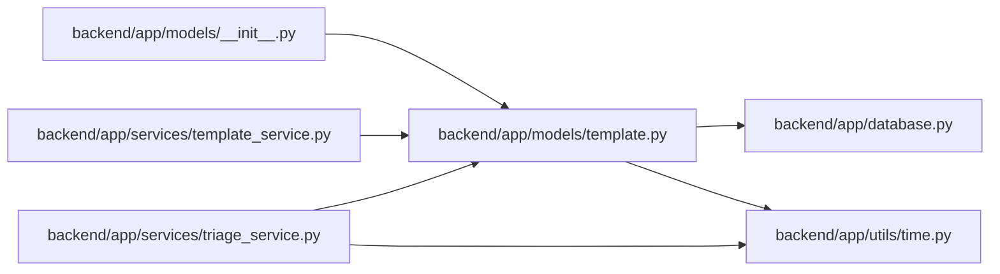

# template Module

**Path:** `backend/app/models/template.py`

## Description

Reusable work template model.

## Imports

| Source | Symbols |
|--------|---------|
| `app.database` | `Base` |
| `app.utils.time` | `UTCDateTime`, `utc_now` |
| `datetime` | `datetime` |
| `enum` | `Enum` |
| `sqlalchemy` | `Boolean`, `CheckConstraint`, `Float`, `Integer`, `JSON`, `String`, `Text` |
| `sqlalchemy.orm` | `Mapped`, `mapped_column` |
| `typing` | `Any`, `Optional` |

## Local dependency map

<!-- Auto-generated local dependency summary. Do not edit by hand. -->

### Internal neighbors

| Direction | Module |
|---|---|
| Inbound | [models___init__](../modules/models___init__.md) |
| Inbound | [template_service](../modules/template_service.md) |
| Inbound | [triage_service](../modules/triage_service.md) |
| Outbound | [app_database](../modules/app_database.md) |
| Outbound | [time](../modules/time.md) |

### External packages

| Language | Used packages | Undeclared packages |
|---|---:|---:|
| python | 1 | 0 |

## Classes

| Class | Kind | Line | Bases / Target | Description |
|-------|------|------|----------------|-------------|
| [TemplateType](../entities/models_template_TemplateType.md) | Enum | 13 | `str`, `Enum` | Template target type. |
| [WorkTemplate](../entities/models_template_WorkTemplate.md) | Class | 20 | `Base` | Reusable defaults for creating tasks, projects, or triage items. |
