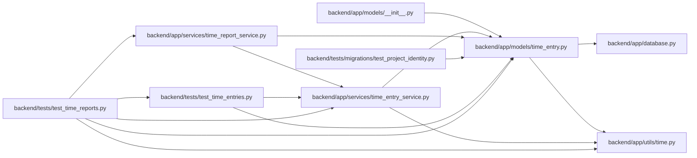

# time_entry Module

**Path:** `backend/app/models/time_entry.py`

## Description

Private explicit work records and retained corrections, independent of task state.

The ledger retains original project/task/principal IDs without deletion-cascading foreign keys. Current records can be corrected or voided only through authorized versioned commands; revisions are append-only. ORM guards reject physical deletion, scope/authorship rewrites and unjournaled mutation. Full database transfer/backup preserves the tables, while task recovery leaves them intact.

## Imports

| Source | Symbols |
|--------|---------|
| `app.database` | `Base` |
| `app.utils.time` | `UTCDateTime`, `utc_now` |
| `datetime` | `date`, `datetime` |
| `sqlalchemy` | `CheckConstraint`, `Date`, `Index`, `Integer`, `String`, `Text`, `UniqueConstraint`, `event`, `inspect` |
| `sqlalchemy.orm` | `Mapped`, `Session`, `mapped_column` |

## Local dependency map

<!-- Auto-generated local dependency summary. Do not edit by hand. -->

### Internal neighbors

| Direction | Module |
|---|---|
| Inbound | [models___init__](../modules/models___init__.md) |
| Inbound | [time_entry_service](../modules/time_entry_service.md) |
| Inbound | [time_report_service](../modules/time_report_service.md) |
| Inbound | [test_project_identity](../modules/test_project_identity.md) |
| Inbound | [test_time_entries](../modules/test_time_entries.md) |
| Inbound | [test_time_reports](../modules/test_time_reports.md) |
| Outbound | [app_database](../modules/app_database.md) |
| Outbound | [time](../modules/time.md) |

### External packages

| Language | Used packages | Undeclared packages |
|---|---:|---:|
| python | 1 | 0 |

## Classes

| Class | Line | Bases | Description |
|-------|------|-------|-------------|
| [TimeEntry](../entities/models_time_entry_TimeEntry.md) | 12 | `Base` | — |
| [TimeEntryRevision](../entities/TimeEntryRevision.md) | 40 | `Base` | — |

## Functions

| Function | Signature | Decorators | Description |
|----------|-----------|------------|-------------|
| `retain_time_entry_history` | `(session, _context, _instances)` | `@event.listens_for(Session, 'before_flush')` | — |
| `reject_time_history_rewrites` | `(state)` | `@event.listens_for(Session, 'do_orm_execute')` | — |