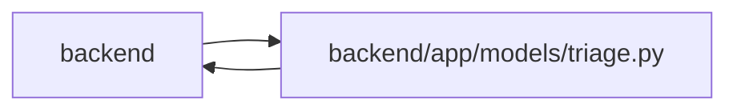

# triage Module

**Path:** `backend/app/models/triage.py`

## Description

Triage item model.

## Imports

| Source | Symbols |
|--------|---------|
| `app.database` | `Base` |
| `app.models.iteration` | `Iteration` |
| `app.models.project` | `Project` |
| `app.models.request_source` | `RequestSourceLink` |
| `app.models.task` | `Task` |
| `app.models.team_member` | `TeamMember` |
| `app.utils.time` | `UTCDateTime`, `utc_now` |
| `datetime` | `datetime` |
| `enum` | `Enum` |
| `sqlalchemy` | `Boolean`, `CheckConstraint`, `Float`, `ForeignKey`, `Integer`, `JSON`, `String`, `Text` |
| `sqlalchemy.orm` | `Mapped`, `mapped_column`, `relationship` |
| `typing` | `TYPE_CHECKING`, `Any`, `Optional` |

## Local dependency map

<!-- Auto-generated local dependency summary. Do not edit by hand. -->

> Module-level dependencies exceed the generated-diagram limits, so the diagram and table below group them by top-level package. Counts report the number of module neighbors in each package.

### Internal neighbors

| Direction | Module |
|---|---|
| Inbound | `backend` (10) |
| Outbound | `backend` (7) |

### External packages

| Language | Used packages | Undeclared packages |
|---|---:|---:|
| python | 1 | 0 |

> All 16 module neighbor(s) are summarized by package because the module-level view exceeds the 12-node limit.

## Classes

| Class | Kind | Line | Bases / Target | Description |
|-------|------|------|----------------|-------------|
| [TriageItemStatus](../entities/models_triage_TriageItemStatus.md) | Enum | 20 | `str`, `Enum` | Triage item lifecycle status. |
| [TriageItem](../entities/models_triage_TriageItem.md) | Class | 30 | `Base` | Raw inbound work item before it becomes scheduled task work. |
| [TriageClassificationSuggestion](../entities/models_triage_TriageClassificationSuggestion.md) | Class | 130 | `Base` | Stored advisory AI classification for a triage item. |
