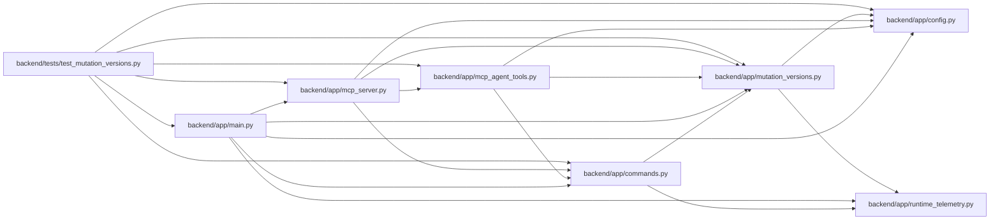

# mutation_versions Module

**Path:** `backend/app/mutation_versions.py`

## Description

The server-controlled strict flag rejects missing optimistic inputs with an actionable resource/field error. Missing observations are deduplicated per command, resource and field. Preview transactions remain rollback-only. Ordinary operator credentials receive no bypass; dedicated offline migration/repair process roles retain their existing authorization and capacity rules.

Server-controlled version rollout with explicit offline repair separation.

## Imports

| Source | Symbols |
|--------|---------|
| `app.config` | `get_settings` |
| `app.runtime_telemetry` | `metrics` |

## Local dependency map

<!-- Auto-generated local dependency summary. Do not edit by hand. -->

### Internal neighbors

| Direction | Module |
|---|---|
| Inbound | [commands](../modules/commands.md) |
| Inbound | [app_main](../modules/app_main.md) |
| Inbound | [mcp_agent_tools](../modules/mcp_agent_tools.md) |
| Inbound | [mcp_server](../modules/mcp_server.md) |
| Inbound | [test_mutation_versions](../modules/test_mutation_versions.md) |
| Outbound | [config](../modules/config.md) |
| Outbound | [runtime_telemetry](../modules/runtime_telemetry.md) |

## Classes

| Class | Line | Bases | Description |
|-------|------|-------|-------------|
| [MissingMutationRevision](../entities/MissingMutationRevision.md) | 7 | `RuntimeError` | A supported command omitted its optimistic input revision. |

## Functions

| Function | Signature | Decorators | Description |
|----------|-----------|------------|-------------|
| `require_mutation_revision` | `(db, value, *, field: str, resource: str, resource_id: int)` | — | Keep missing inputs observable; ordinary operators receive no bypass. |
