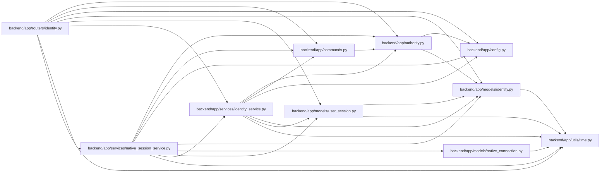

# native_session_service Module

**Path:** `backend/app/services/native_session_service.py`

## Description

Owns proof-bound native session creation and browser approval. Public start/exchange paths require bounded inputs; approval requires a human session and normal browser request integrity. The exchange checks current account/session validity, locks the principal before the approving session, and atomically consumes the connection while issuing an opaque bearer session.

## Imports

| Source | Symbols |
|--------|---------|
| `app.authority` | `AuthorityError`, `internal_authority` |
| `app.commands` | `atomic_command` |
| `app.config` | `get_settings` |
| `app.models.identity` | `Principal` |
| `app.models.native_connection` | `NativeConnection` |
| `app.models.user_session` | `UserSession` |
| `app.services.identity_service` | `IdentityService`, `digest`, `require_identity_writes` |
| `app.utils.time` | `as_utc`, `utc_now` |
| `base64` | `base64` |
| `datetime` | `timedelta` |
| `hashlib` | `hashlib` |
| `secrets` | `secrets` |
| `sqlalchemy` | `delete`, `func`, `select`, `update` |
| `urllib.parse` | `urlencode` |

## Local dependency map

<!-- Auto-generated local dependency summary. Do not edit by hand. -->

### Internal neighbors

| Direction | Module |
|---|---|
| Inbound | [routers_identity](../modules/routers_identity.md) |
| Outbound | [authority](../modules/authority.md) |
| Outbound | [commands](../modules/commands.md) |
| Outbound | [config](../modules/config.md) |
| Outbound | [models_identity](../modules/models_identity.md) |
| Outbound | [native_connection](../modules/native_connection.md) |
| Outbound | [user_session](../modules/user_session.md) |
| Outbound | [identity_service](../modules/identity_service.md) |
| Outbound | [time](../modules/time.md) |

### External packages

| Language | Used packages | Undeclared packages |
|---|---:|---:|
| python | 1 | 0 |

## Classes

| Class | Line | Bases | Description |
|-------|------|-------|-------------|
| [NativeSessionService](../entities/NativeSessionService.md) | 21 | — | — |