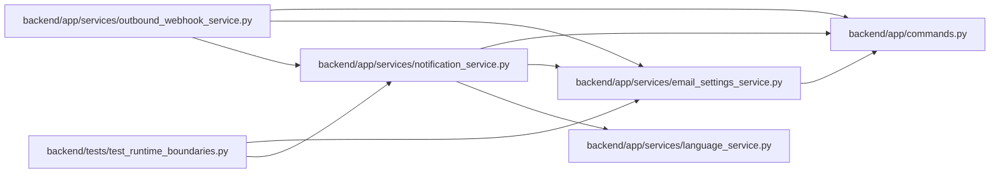

# notification_service Module

**Path:** `backend/app/services/notification_service.py`

## Description

Email notification service for task status changes.

## Imports

| Source | Symbols |
|--------|---------|
| `aiosmtplib` | `aiosmtplib` |
| `app.commands` | `commit_or_flush` |
| `app.services.email_settings_service` | `EmailSettingsService` |
| `app.services.language_service` | `notification_overdue_body_html`, `notification_overdue_subject`, `notification_status_change_body_html`, `notification_status_change_subject`, `resolve_runtime_ui_language` |
| `asyncio` | `asyncio` |
| `datetime` | `date` |
| `email.mime.multipart` | `MIMEMultipart` |
| `email.mime.text` | `MIMEText` |
| `logging` | `logging` |
| `typing` | `Optional` |

## Local dependency map

<!-- Auto-generated local dependency summary. Do not edit by hand. -->

### Internal neighbors

| Direction | Module |
|---|---|
| Inbound | [outbound_webhook_service](../modules/outbound_webhook_service.md) |
| Inbound | [test_runtime_boundaries](../modules/test_runtime_boundaries.md) |
| Outbound | [commands](../modules/commands.md) |
| Outbound | [email_settings_service](../modules/email_settings_service.md) |
| Outbound | [language_service](../modules/language_service.md) |

### External packages

| Language | Used packages | Undeclared packages |
|---|---:|---:|
| python | 1 | 0 |

## Classes

| Class | Line | Bases | Description |
|-------|------|-------|-------------|
| [NotificationService](../entities/NotificationService.md) | 24 | — | Service for sending email notifications about task status changes. |

## Functions

| Function | Signature | Decorators | Description |
|----------|-----------|------------|-------------|
| `get_notification_service` | `(db = None) -> NotificationService` | — | Get or create notification service instance. |
